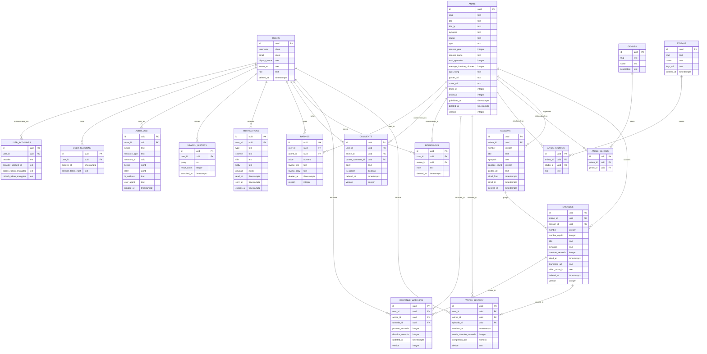

# Entity-Relationship Diagram

> **Step 7 — Database Design**
> This document is the visual map of the relational schema. Field-level detail lives in the per-entity documents; this file shows **entities, relationships, and cardinalities**.

---

## 1. How to Read This Diagram

- **Boxes** = tables. The first row is the primary key; `FK` marks foreign keys.
- **Lines** = relationships. Notation: `||` one, `o{` zero-or-many, `|{` one-or-many.
- **Join tables** (`anime_genres`, `anime_studios`) are shown explicitly — they are real tables with their own PK and timestamps, not just link tables.
- All tables carry the cross-cutting columns from `Database-Overview.md` (`id`, `created_at`, `updated_at`, `deleted_at`, `version`, audit fields) — they are omitted from the diagram for readability but **exist on every table**.

---

## 2. Full Entity-Relationship Diagram

---

## 3. Relationship Detail

### 3.1 Identity Cluster

| Parent  | Child               | Cardinality | On-delete behavior                                                              |
| ------- | ------------------- | ----------- | ------------------------------------------------------------------------------- |
| `users` | `user_accounts`     | 1 : 0..\*   | Hard-delete accounts when user is hard-deleted (erasure).                       |
| `users` | `user_sessions`     | 1 : 0..\*   | Hard-delete on user hard-delete; expire naturally via `expires_at`.             |
| `users` | `watch_history`     | 1 : 0..\*   | **Preserve** on soft-delete (anonymize); hard-delete on erasure.                |
| `users` | `continue_watching` | 1 : 0..\*   | Cascade hard-delete on user erasure.                                            |
| `users` | `bookmarks`         | 1 : 0..\*   | Cascade hard-delete on user erasure.                                            |
| `users` | `comments`          | 1 : 0..\*   | **Preserve** author label as `[deleted]` on erasure; keep the comment.          |
| `users` | `ratings`           | 1 : 0..\*   | Cascade hard-delete on user erasure.                                            |
| `users` | `notifications`     | 1 : 0..\*   | Cascade hard-delete on user erasure.                                            |
| `users` | `search_history`    | 1 : 0..\*   | Cascade hard-delete on user erasure.                                            |
| `users` | `audit_log`         | 1 : 0..\*   | **Never delete** — audit log is immutable and actor is preserved as a snapshot. |

### 3.2 Catalog Cluster

| Parent    | Child           | Cardinality | Notes                                                            |
| --------- | --------------- | ----------- | ---------------------------------------------------------------- |
| `anime`   | `seasons`       | 1 : 0..\*   | A show may have zero seasons if undated.                         |
| `anime`   | `episodes`      | 1 : 0..\*   | Direct link for flat (non-seasonal) shows.                       |
| `seasons` | `episodes`      | 1 : 0..\*   | Episodes belong to exactly one season.                           |
| `anime`   | `anime_genres`  | 1 : 0..\*   | Many-to-many via join table.                                     |
| `anime`   | `anime_studios` | 1 : 0..\*   | Many-to-many via join table, with `role` (production/licensing). |
| `genres`  | `anime_genres`  | 1 : 0..\*   | Genre is a shared taxonomy.                                      |
| `studios` | `anime_studios` | 1 : 0..\*   | Studio is a shared taxonomy.                                     |

### 3.3 Engagement Cluster

| Parent              | Child               | Cardinality | Notes                                              |
| ------------------- | ------------------- | ----------- | -------------------------------------------------- |
| `users` + `anime`   | `bookmarks`         | 1 : 0..1    | Unique `(user_id, anime_id)` where not deleted.    |
| `users` + `anime`   | `ratings`           | 1 : 0..1    | Unique `(user_id, anime_id)` where not deleted.    |
| `users` + `anime`   | `comments`          | 1 : 0..\*   | Threaded via `parent_comment_id` self-reference.   |
| `users` + `episode` | `watch_history`     | 1 : 0..\*   | Append-only log; one row per watch event.          |
| `users` + `episode` | `continue_watching` | 1 : 0..\*   | One cursor per `(user, anime)` — updated in place. |

### 3.4 Self-Reference

- `comments.parent_comment_id` → `comments.id` — threaded replies. A comment's parent must belong to the same `anime_id` (enforced in application logic + a composite FK pattern).

---

## 4. Entity Groupings

The 20 documents map to four clusters:

| Cluster        | Tables                                                                               | Documents                                                                            |
| -------------- | ------------------------------------------------------------------------------------ | ------------------------------------------------------------------------------------ |
| **Identity**   | `users`, `user_accounts`, `user_sessions`                                            | `User.md`                                                                            |
| **Catalog**    | `anime`, `seasons`, `episodes`, `genres`, `studios`, `anime_genres`, `anime_studios` | `Anime.md`, `Season.md`, `Episode.md`, `Genre.md`, `Studio.md`                       |
| **Engagement** | `watch_history`, `continue_watching`, `bookmarks`, `comments`, `ratings`             | `Watch-History.md`, `Continue-Watching.md`, `Bookmark.md`, `Comment.md`, `Rating.md` |
| **Operations** | `notifications`, `search_history`, `audit_log`                                       | `Notification.md`, `Search-History.md`, `Audit-Log.md`                               |

---

## 5. Key Design Decisions (Diagram-Level)

1. **Episodes link to both `anime` and `season`.** The `anime_id` on `episode` is denormalized for query simplicity (most queries are "episodes of a show"); `season_id` provides the precise grouping. A check constraint ensures the season belongs to the same anime.

2. **Join tables are first-class.** `anime_genres` and `anime_studios` have their own `id`, `created_at`, and (where relevant) extra columns (`role` on studios). This avoids the limitations of Postgres' anonymous many-to-many links and lets us index and timestamp associations.

3. **Engagement tables reference `anime` even when they reference `episode`.** This is intentional denormalization: it lets us query "all anime a user has watched" without joining through episodes, and it keeps bookmark/rating/watchlist semantics at the show level while still tracking the specific episode.

4. **`continue_watching` is separate from `watch_history`.** History is an append-only log; continue-watching is a mutable cursor. Separating them avoids locking the log on every playback heartbeat.

5. **`audit_log` references `users` but is immutable.** Even when a user is hard-deleted, the audit row is retained with a denormalized actor snapshot (stored in `before`/`after` JSONB) so the log is never orphaned.
