# M2.7 — Authentication Architecture

> **Scope:** This document defines the **complete authentication and authorization architecture for Nexus Anime** as delivered under Milestone 2 (Sprints 4–5). It covers authentication flows, authorization model, session lifecycle, trust boundaries, and the full security architecture.

> **Status:** Draft — Pending Review
> **Date:** 2026-06-25
> **Author:** Tech Lead
> **Milestone:** M2 (Sprints 4–5)

---

## Table of Contents

1. [Executive Summary](#1-executive-summary)
2. [Technology Selection](#2-technology-selection)
3. [Deliverable 1: Authentication Flows](#3-deliverable-1-authentication-flows)
4. [Deliverable 2: Authorization Flow](#4-deliverable-2-authorization-flow)
5. [Deliverable 3: Session Lifecycle](#5-deliverable-3-session-lifecycle)
6. [Deliverable 4: Trust Boundaries](#6-deliverable-4-trust-boundaries)
7. [Deliverable 5: Security Architecture](#7-deliverable-5-security-architecture)
8. [Implementation Guidance](#8-implementation-guidance)
9. [Risks & Mitigations](#9-risks--mitigations)
10. [Future Considerations](#10-future-considerations)
11. [References](#11-references)

---

## 1. Executive Summary

เอกสารนี้นิยามสถาปัตยกรรมระบบรับรองตัวตน (Authentication) และการให้สิทธิ์ (Authorization) ทั้งหมดของ Nexus Anime ภายใต้ Milestone 2 (Sprint 4–5) โดยครอบคลุมตั้งแต่การออกแบบระบบไปจนถึงการประยุกต์ใช้งานจริง

### ขอบเขต (Scope)

สถาปัตยกรรมนี้ครอบคลุม Deliverables หลัก 5 ด้าน:

1. **Authentication Flows** — การไหลของข้อมูลตอนสมัครสมาชิก เข้าสู่ระบบ ออกจากระบบ รีเซ็ตรหัสผ่าน และเข้าสู่ระบบด้วย OAuth
2. **Authorization Flow** — ระบบชั้นบทบาท (Role-based) กลไกป้องกันระดับหน้าเว็บและ API และการตรวจสิทธิ์ระดับทรัพยากร
3. **Session Lifecycle** — วงจรชีวิตของ JWT Token ตั้งแต่สร้าง ตรวจสอบ รีเฟรช ไปจนถึงการยกเลิก
4. **Trust Boundaries** — โมเดลโซนความเชื่อถือ 6 ระดับตั้งแต่ไคลเอนต์ไปจนถึง External Services
5. **Security Architecture** — การป้องกัน CSRF, CORS Policy, Secret Management, Encryption และ Audit Logging

### กลยุทธ์หลัก (Key Strategy)

| ด้าน | ทางเลือก | เหตุผล |
|------|---------|--------|
| Auth Library | Auth.js v5 (`next-auth@5`) | รองรับ Next.js App Router แบบดั้งเดิม มี Credentials + OAuth ในตัว |
| Session Format | JWT ใน HTTP-only cookie | ไม่ต้องเข้าฐานข้อมูลทุกครั้งที่รับข้อร้อง รองรับ Vercel Edge หลาย instance |
| Cookie Name | `__Host-nexus-session` | กำหนดให้ต้องมี Secure, Path=/, ไม่มี Domain (ตึกกับโฮสต์เท่านั้น) |
| Password Hashing | bcrypt (12 rounds) | มาตรฐานอุตสาหกรรม ทนต่อการโจมตีด้วย GPU ได้ดี |
| OAuth Providers | Google (MVP) + Discord (Beta) | Google เป็นหลักในการเข้าสู่ระบบ Discord สำหรับชุมนักเกม |
| Token Signing | HMAC-SHA256 + `AUTH_SECRET` | ค่าเริ่มต้นของ Auth.js ต้องมี secret 32 ไบต์ขึ้นไป |

### ความสอดคล้องกับ Repository

เอกสารนี้สอดคล้องกับสถาปัตยกรรมที่กำหนดไว้ใน Repository:
- ฐานข้อมูล PostgreSQL ผ่าน Drizzle ORM (`docs/database-design.md`)
- Redis cache ผ่าน `@nexus/cache` package (`docs/redis-strategy.md`)
- API envelope contract = `{ data }` / `{ error: { message, code, details } }` (`docs/api-specification.md`)
- Environment validation ผ่าน Zod ใน `lib/env.ts` (`docs/milestone-1-project-foundation.md`)

---

## 2. Technology Selection

### 2.1 Core Library: Auth.js v5 (NextAuth.js)

| ด้าน | ทางเลือก | เหตุผล |
|------|---------|--------|
| Auth library | Auth.js v5 (`next-auth@5`) | Native Next.js integration, App Router support, Credentials + OAuth built-in, JWT sessions, CSRF protection built-in |
| Session format | JWT in HTTP-only cookie | Stateless validation (no DB lookup per request), scalable across Vercel edge instances |
| Cookie name | `__Host-nexus-session` | `__Host-` prefix enforces Secure, Path=/, no Domain (host-only cookie) |
| Password hashing | bcrypt (via Auth.js) | Industry standard, 12 rounds, resistant to GPU attacks |
| OAuth providers | Google (MVP), Discord (Beta) | Google for primary social login; Discord for gaming community alignment |
| Token signing | HMAC-SHA256 with `AUTH_SECRET` | Auth.js default; 32+ byte secret from `openssl rand -base64 32` |

### 2.2 Workspace Package: `@nexus/auth`

```
packages/auth/
├── src/
│   ├── config.ts          # Auth.js configuration (providers, callbacks, events)
│   ├── handlers.ts        # Route handler factory for /api/auth/[...nextauth]
│   ├── guards.ts          # requireAuth, requireSubscriber, requireRole
│   ├── session.ts         # getSession, getSessionUser helpers
│   ├── callbacks.ts       # Custom JWT/session callbacks (role injection)
│   └── index.ts           # Public API barrel
├── package.json
└── tsconfig.json
```

### 2.3 Dependencies

```json
{
  "name": "@nexus/auth",
  "version": "0.0.0",
  "private": true,
  "dependencies": {
    "next-auth": "^5.0.0-beta.25"
  },
  "peerDependencies": {
    "next": "^16.0.0"
  }
}
```

### 2.4 Workspace Graph (Auth Context)

```mermaid
graph TD
    web[apps/web] --> auth[@nexus/auth]
    web --> db[@nexus/db]
    web --> cache[@nexus/cache]
    web --> ui[@nexus/ui]
    auth --> db
    auth --> config-typescript[@nexus/config-typescript]
    cache --> config-typescript
    db --> config-typescript
    ui --> config-typescript
```

---

## 3. Deliverable 1: Authentication Flows

### 3.1 Sign Up (Email Credentials)

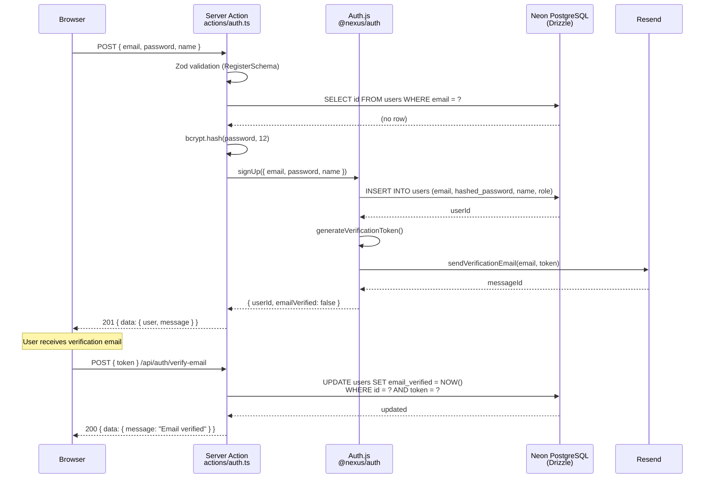

**Step-by-step:**

1. ไคลเอนต์ส่ง `POST /api/auth/register` (Server Action) ด้วย `{ email, password, name }`
2. Server Action ตรวจสอบด้วย `RegisterSchema` (Zod: email format, password 8 ตัวอักษรขึ้นไป + uppercase + number, name 1–50 ตัวอักษร)
3. Service layer ตรวจสอบตาราง `users` ว่ามี email นี้อยู่แล้ว — ถ้ามีคืน `CONFLICT` (409)
4. เข้ารหัสรหัสผ่านด้วย bcrypt (cost factor 12)
5. เพิ่มข้อมูลผู้ใช้ในตาราง `users` ด้วย `role: 'user'`, `email_verified: null`
6. สร้าง verification token (24 ไบต์ random, SHA-256 hashed, เก็บในฐานข้อมูลด้วย 24 ชม. หมดอายุ)
7. Resend ส่งอีเมลยืนยันพร้อม `https://nexusanime.com/api/auth/verify-email?token=...`
8. เมื่อยืนยันเสร็จ `email_verified` ถูกตั้งเป็น `NOW()` และ token ถูกยกเลิก

### 3.2 Log In (Email Credentials)

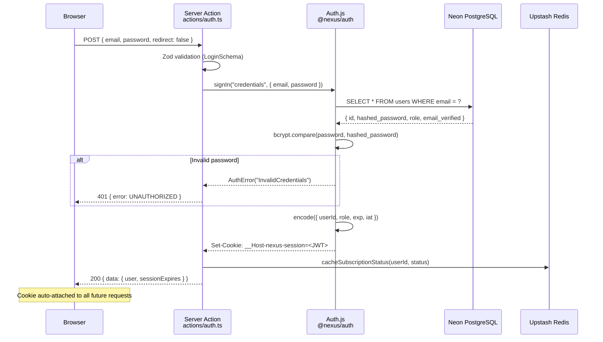

**Step-by-step:**

1. ไคลเอนต์ส่ง `POST /api/auth/callback/credentials` ด้วย `{ email, password }`
2. Auth.js credentials provider ค้นหาผู้ใช้จาก email ในตาราง `users`
3. เปรียบเทียบ bcrypt ของรหัสผ่านที่ส่งมากับ `hashed_password`
4. ถ้าไม่ตรง: คืน 401 พร้อมข้อความ "Invalid email or password" แบบไม่เฉพาะเจาะจง (ป้องกัน enumeration)
5. ถ้าตรง: Auth.js สร้าง JWT ด้วย `{ sub: userId, role, email, exp }`
6. JWT ถูกเข้ารหัสด้วย `AUTH_SECRET` (HMAC-SHA256)
7. Set-Cookie: `__Host-nexus-session` ด้วย `HttpOnly; Secure; SameSite=Lax; Path=/; Max-Age=2592000` (30 วัน)
8. Post-login callback เก็บสถานะ subscription ใน Redis (TTL 5 นาที)
9. Response คืน `{ data: { user: { id, email, name, role }, sessionExpires } }`

### 3.3 Log Out

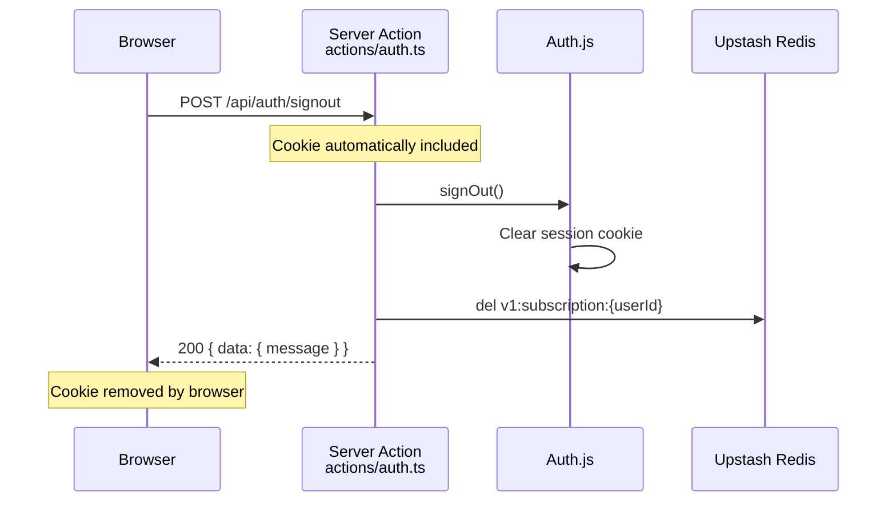

**Step-by-step:**

1. ไคลเอนต์ส่ง `POST /api/auth/signout` (Server Action)
2. Auth.js ยกเลิก session (ลบ cookie ด้วย `Max-Age=0`)
3. Server Action ลบข้อมูล subscription cache ของผู้ใช้ใน Redis
4. Response ยืนยันการออกจากระบบ

### 3.4 Password Reset

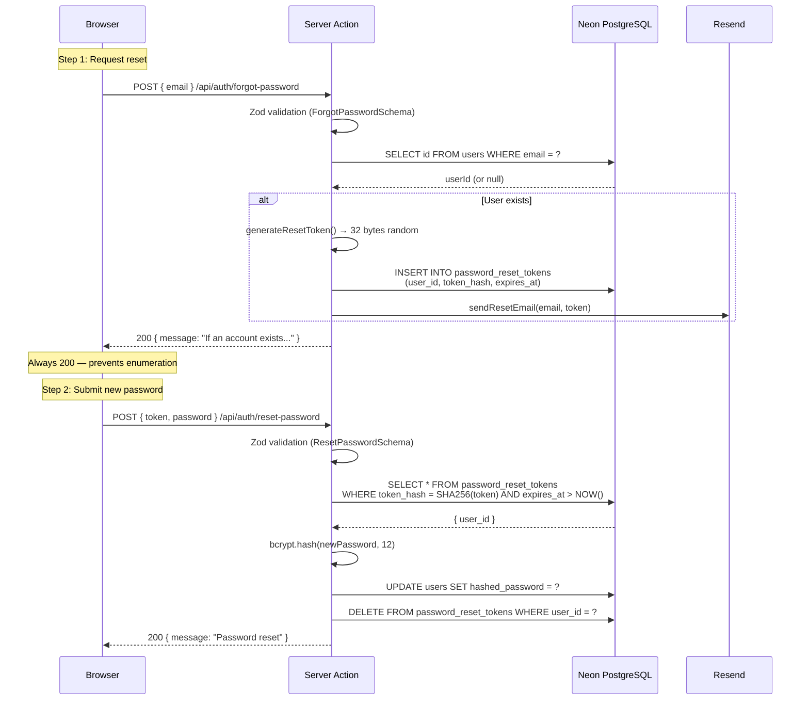

**Key design decisions:**
- Forgot-password ส่ง response 200 เสมอเพื่อป้องกัน email enumeration
- Reset token ถูกเข้ารหัสด้วย SHA-256 ก่อนจัดเก็บ (token ดั้งเดิมอยู่ในอีเมลเท่านั้น)
- Token หมดอายูภายใน 1 ชั่วโมง
- เมื่อรีเซ็ตสำเร็จ ทุก session ที่มีอยู่จะถูกยกเลิก (ตรวจสอบผ่าน `iat` claim)

### 3.5 Google OAuth

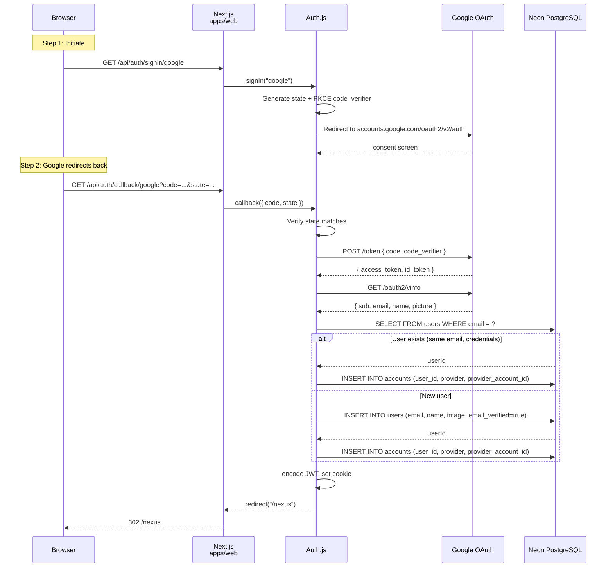

**Key design decisions:**
- Auth.js ตรวจสอบ state parameter (ป้องกัน CSRF)
- PKCE ถูกเปิดใช้งานโดยค่าเริ่มต้นใน Auth.js v5
- Account linking: ถ้ามี email เดิมในระบบด้วย credentials ให้เชื่อมโยง OAuth account (ไม่สร้างซำ้า)
- `email_verified` ถูกตั้งเป็น `true` สำหรับผู้ใช้ที่เข้าสู่ระบบด้วย Google (Google ยืนยัน email แล้ว)

### 3.6 Session Resolution (Request-Time)

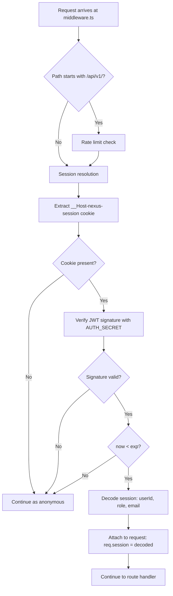

---

## 4. Deliverable 2: Authorization Flow

### 4.1 Role Hierarchy

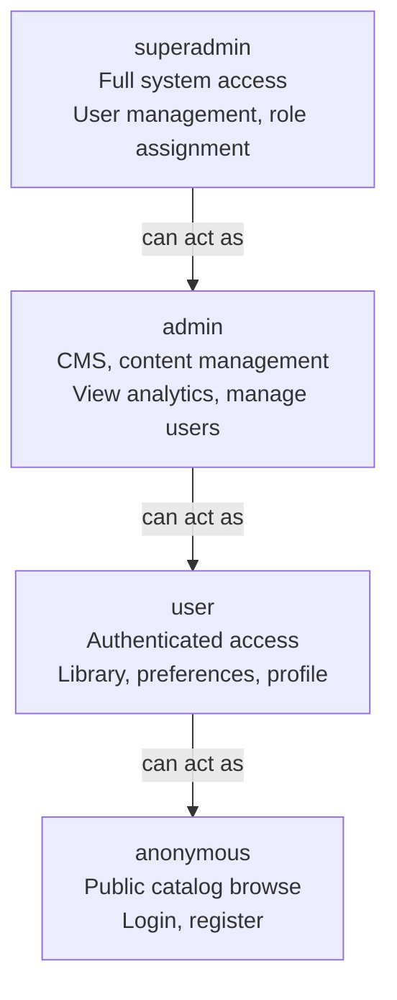

| Role | Capabilities |
|------|-------------|
| `anonymous` | เข้าถึง catalog สาธารณะ ค้นหา ดูหน้าเว็บสาธารณะ |
| `user` | ทุกอย่างของ anonymous + จัดการโปรไฟล์, ไลบรารี, watchlist, favorites, reviews ของตัวเอง |
| `admin` | ทุกอย่างของ user + CMS (สร้าง/แก้ไข titles, episodes, shelves) ดู analytics จัดการผู้ใช้ |
| `superadmin` | ทุกอย่างของ admin + มอบหมาย role ระงับผู้ใช้ ตั้งค่าระบบ |

### 4.2 Authorization Guards

```mermaid
flowchart LR
    A[Request] --> B{Guard Type}

    B -->|Page Guard| C{middleware.ts matcher}
    B -->|API Guard| D{Route handler check}

    C --> E[/nexus/* → requireAuth]
    C --> F[/nexus/watch/* → requireSubscriber]
    C --> G[/admin/* → requireRole admin]

    D --> H[API route checks]
    H --> I[requireAuth → 401 if no session]
    H --> J[requireSubscriber → 403 if no active sub]
    H --> K[requireRole → 403 if role insufficient]
    H --> L[requireOwner → 403 if not resource owner]
```

### 4.3 Guard Definitions

```typescript
// packages/auth/src/guards.ts

// Page-level guard: used in middleware.ts
// Redirects to /login if unauthenticated
export async function requireAuth(
  request: NextRequest,
): Promise<{ session: Session } | { redirect: string }> {
  const session = await getSession(request);
  if (!session?.user) {
    return { redirect: `/login?callbackUrl=${encodeURIComponent(request.url)}` };
  }
  return { session };
}

// Page-level guard: used in middleware.ts for /nexus/watch/*
// Redirects to /pricing if no active subscription
export async function requireSubscriber(
  request: NextRequest,
): Promise<{ session: Session; subscription: Subscription } | { redirect: string }> {
  const auth = await requireAuth(request);
  if ("redirect" in auth) return { redirect: auth.redirect };

  const subscription = await getSubscriptionStatus(auth.session.user.id);
  if (subscription.status !== "active" && subscription.status !== "trialing") {
    return { redirect: "/pricing" };
  }
  return { session: auth.session, subscription };
}

// API-level guard: used in route handlers
// Returns 401 JSON if no session
export function requireApiAuth(session: Session | null): asserts session is Session {
  if (!session?.user) {
    throw new ApiError(401, "UNAUTHORIZED", "Authentication required");
  }
}

// API-level guard: checks subscription
export async function requireApiSubscriber(
  session: Session | null,
): Promise<Subscription> {
  requireApiAuth(session);
  const sub = await getSubscriptionStatus(session.user.id);
  if (sub.status !== "active" && sub.status !== "trialing") {
    throw new ApiError(403, "FORBIDDEN", "Active subscription required");
  }
  return sub;
}

// API-level guard: checks role
export function requireRole(session: Session | null, role: "admin" | "superadmin"): void {
  requireApiAuth(session);
  const roleHierarchy = { user: 0, admin: 1, superadmin: 2 };
  if (roleHierarchy[session.user.role] < roleHierarchy[role]) {
    throw new ApiError(403, "FORBIDDEN", `Requires ${role} role`);
  }
}

// Resource-level guard: checks ownership
export function requireOwner(
  session: Session | null,
  resourceOwnerId: string,
): void {
  requireApiAuth(session);
  if (session.user.id !== resourceOwnerId && session.user.role !== "admin") {
    throw new ApiError(403, "FORBIDDEN", "You do not own this resource");
  }
}
```

### 4.4 Route Protection Matrix

| Route Pattern | Guard | กรณีไม่ผ่าน |
|---------------|-------|-----------|
| `/api/v1/*` | Rate limit (100 req/15min per IP) | 429 |
| `/api/v1/webhooks/*` | Stripe signature verification | 400 |
| `/api/v1/nexus/*` | `requireApiAuth()` | 401 |
| `/api/v1/nexus/watch/*` | `requireApiSubscriber()` | 403 |
| `/api/v1/admin/*` | `requireRole('admin')` + `X-API-Key` | 403 |
| `/nexus/*` (pages) | `requireAuth()` (middleware) | 302 → /login |
| `/nexus/watch/*` (pages) | `requireSubscriber()` (middleware) | 302 → /pricing |
| `/admin/*` (pages) | `requireRole('admin')` (middleware) | 302 → /login |

### 4.5 Resource-Level Authorization

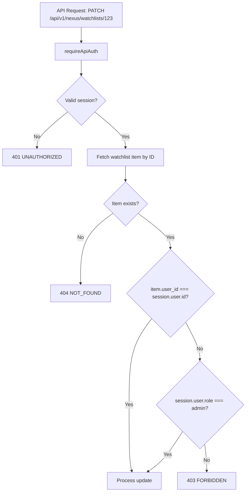

---

## 5. Deliverable 3: Session Lifecycle

### 5.1 Token Issuance

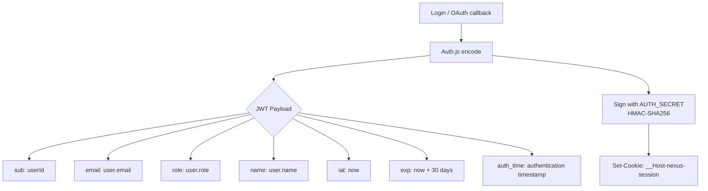

**JWT payload structure:**

```typescript
interface SessionJWT {
  sub: string;          // user ID (UUID)
  email: string;
  name: string | null;
  image: string | null;
  role: "user" | "admin" | "superadmin";
  emailVerified: string | null;
  iat: number;          // issued at (seconds since epoch)
  exp: number;          // expiration (seconds since epoch)
  auth_time: number;    // when authentication occurred
  jti: string;          // unique token ID (for revocation)
}
```

### 5.2 Token Validation

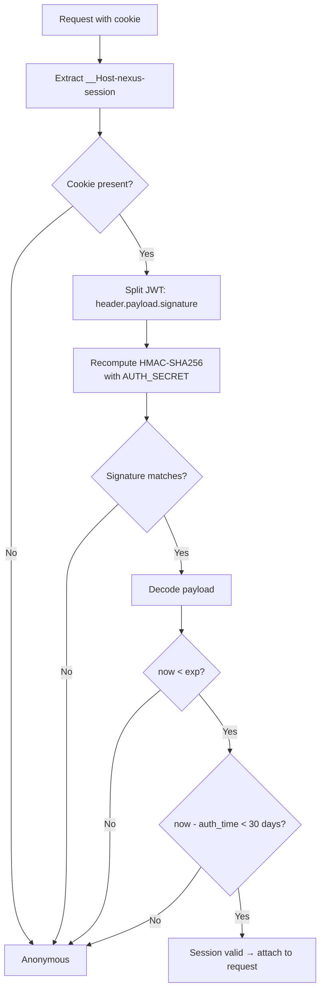

**Validation performed at each request:**
1. ดึง cookie จาก `Cookie` header
2. ตรวจสอบ JWT signature (HMAC-SHA256 ด้วย `AUTH_SECRET`)
3. ตรวจสอบการหมดอายุ (`exp > now`)
4. ตรวจสอบหน้าต่างรีเฟรช (`auth_time` ภายใน 30 วัน)
5. ตรวจสอบ JTI revocation (สำหรับ logout ก่อนหมดอายุ)

### 5.3 Token Refresh (Rolling Sessions)

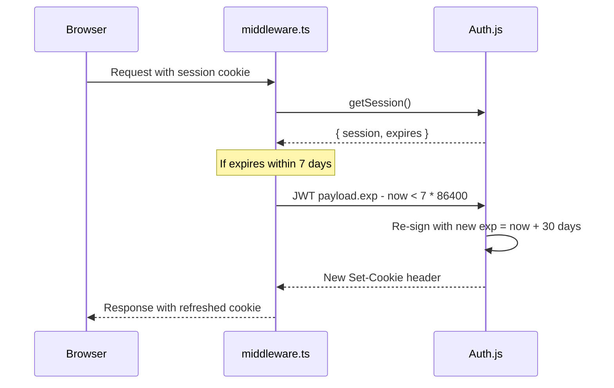

**Rolling session policy:**
- Session หมดอายุ 30 วันหลังจาก authentication event ล่าสุด
- ถ้าเวลาที่เหลือ < 7 วัน Auth.js จะ re-sign อัตโนมัติด้วย `exp = now + 30 วัน`
- Cookie `Max-Age` ถูกอัปเดตให้ตรงกับ expiration ใหม่
- ผู้ใช้ไม่ต้องทำอะไรเพิ่มเติม

### 5.4 Token Rotation

Token rotation เกิดขึ้นเมื่อมีเหตุการณ์เปลี่ยนแปลงสิทธิ์:

| Event | Action |
|-------|--------|
| เปลี่ยนรหัสผ่าน | ยกเลิกทุก session ที่มีอยู่ (JTI blacklist) |
| เปลี่ยน role (admin) | ออก session ใหม่พร้อม role claim ใหม่ |
| ลบบัญชี | ยกเลิกทุก session ทั้งหมด ลบ cookie |
| เชื่อมโยง OAuth account | อัปเดต session ปัจจุบันด้วยข้อมูล provider ใหม่ |

**JTI-based revocation:**

```typescript
// เมื่อ logout หรือเปลี่ยนรหัสผ่าน
await redis.sadd("revoked_sessions", jti);
await redis.expire("revoked_sessions", 30 * 86400); // 30 วัน

// เมื่อตรวจสอบ session
const isRevoked = await redis.sismember("revoked_sessions", jti);
if (isRevoked) return null; // ถือว่าไม่ได้ authenticate
```

### 5.5 Token Expiration

| สถานการณ์ | TTL | กลไก |
|----------|-----|------|
| Idle timeout | 30 วันจากการ authenticate ล่าสุด | JWT `exp` claim |
| Absolute max | 30 วัน (รีเฟรชต่อเนื่อง) | Re-sign เมื่อเหลือ < 7 วัน |
| Password reset | ทันที | JTI blacklist |
| Logout | ทันที | ลบ cookie + JTI blacklist |
| ลบบัญชี | ทันที | ยกเลิกทุก JTI ของผู้ใช้ |

### 5.6 Session Cleanup

```mermaid
flowchart TD
    A[Cron job / Vercel Cron] --> B[Scan revoked_sessions set]
    B --> C[Remove entries older than 30 days]
    C --> D[Scan password_reset_tokens]
    D --> E[Delete where expires_at < NOW()]
    E --> F[Scan expired stream_assets]
    F --> G[Delete where expires_at < NOW()]
```

---

## 6. Deliverable 4: Trust Boundaries

### 6.1 Trust Zone Model

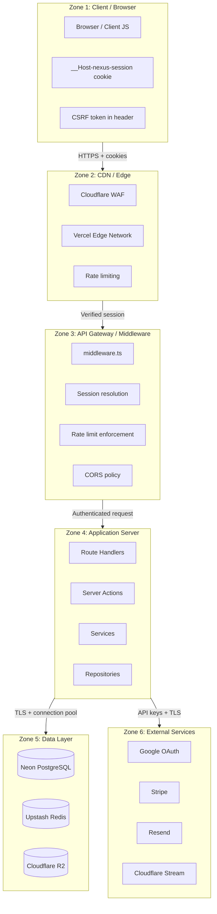

### 6.2 Boundary Verification Matrix

| Boundary | Incoming | Verification | Outgoing Protection |
|----------|----------|-------------|---------------------|
| **Client → Edge** | HTTP requests | Cloudflare WAF rules, HSTS, Bot Fight Mode | TLS 1.3, HSTS preload |
| **Edge → Middleware** | Forwarded requests | IP-based rate limiting (Upstash Redis sliding window) | Strip internal headers |
| **Middleware → Route Handler** | Session cookie | JWT signature + expiry + JTI revocation check | Never forward raw cookie to client |
| **Route Handler → Service** | User input | Zod validation on all inputs | Sanitized parameters only |
| **Service → Repository** | Query parameters | Parameterized queries (Drizzle ORM) | No raw SQL strings |
| **Repository → Database** | SQL queries | Prepared statements, connection pooling | TLS encryption in transit |
| **Application → External** | API calls | API keys from `lib/env.ts`, request signing | TLS, certificate pinning |

### 6.3 Zone-Specific Controls

#### Zone 1: Client/Browser

| Control | Implementation |
|---------|---------------|
| Cookie attributes | `__Host-` prefix, `HttpOnly`, `Secure`, `SameSite=Lax`, `Path=/` |
| CSP | `script-src 'self'; object-src 'none'; base-uri 'self'` |
| CSRF | SameSite cookie + `X-CSRF-Token` header สำหรับ mutations |
| XSS defense | React auto-escaping + CSP |
| Sensitive data | ไม่เก็บใน `localStorage` (ใช้ HTTP-only cookies เท่านั้น) |

#### Zone 2: CDN/Edge

| Control | Implementation |
|---------|---------------|
| WAF | Cloudflare managed rules (OWASP, anime-specific) |
| DDoS | Cloudflare Unmetered DDoS mitigation |
| Rate limiting | Upstash Redis sliding window at edge |
| Bot protection | Cloudflare Bot Fight Mode |
| TLS | ขั้นต่ำ TLS 1.2, HSTS with preload |
| Cache | ISR pages cached at edge; ไม่มีการ cache API responses |

#### Zone 3: Middleware

| Control | Implementation |
|---------|---------------|
| Session resolution | JWT verification ทุก request |
| Rate limiting | Per-IP sliding window (100 req/15min) |
| CORS | Same-origin only ใน production; localhost ใน dev |
| Security headers | `X-Content-Type-Options: nosniff`, `X-Frame-Options: DENY`, `Referrer-Policy: strict-origin-when-cross-origin` |
| Auth redirect | Unauthenticated → `/login?callbackUrl=...` |
| Subscription gate | Non-subscriber → `/pricing` |

#### Zone 4: Application Server

| Control | Implementation |
|---------|---------------|
| Input validation | Zod schemas บนทุก API inputs |
| Authorization | Guard chain (auth → subscription → role → ownership) |
| Error handling | Typed errors, ไม่มี stack traces ใน production |
| Output encoding | JSON envelope, ไม่มี raw user content ใน responses |
| Secret access | ผ่าน `lib/env.ts` เท่านั้น, ไม่มีใน client code |

#### Zone 5: Data Layer

| Control | Implementation |
|---------|---------------|
| Database encryption | Neon PostgreSQL: AES-256 at rest (managed by Neon) |
| Redis encryption | Upstash: encryption in transit (TLS), ไม่มี persistent secrets |
| R2 encryption | Cloudflare R2: AES-256 at rest |
| Connection security | TLS 1.3 สำหรับ database connections ทั้งหมด |
| Credential rotation | Neon PITR-compatible rotation via Vercel env update |
| Backup | Neon automated backups (7-day retention, PITR) |

#### Zone 6: External Services

| Control | Implementation |
|---------|---------------|
| API key storage | Vercel encrypted env vars, ไม่มีใน code |
| Request signing | Stripe webhook HMAC-SHA256 verification |
| OAuth state | Auth.js built-in PKCE + state parameter |
| Email signing | Resend API key with minimal permissions |
| Stream signing | Cloudflare Stream signed URLs (4h TTL) |

---

## 7. Deliverable 5: Security Architecture

### 7.1 CSRF Protection

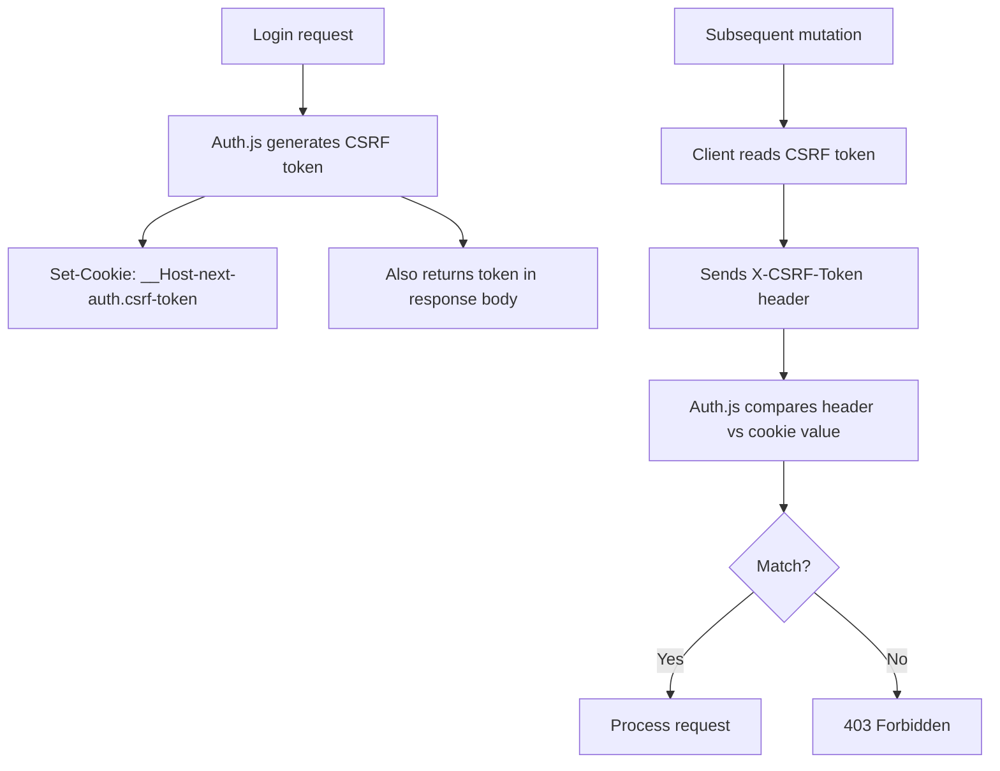

**Layers of CSRF protection:**
1. **SameSite=Lax cookie** — ป้องกันการแนบ cookie ข้าม origin
2. **CSRF token** — Auth.js double-submit cookie pattern
3. **`__Host-` prefix** — cookie ถูกผูกกับ host (ไม่มี subdomain leakage)
4. **Origin header check** — middleware ตรวจสอบ `Origin` ว่าตรงกับค่าที่คาดหวัง

### 7.2 CORS Policy

```typescript
// apps/web/middleware.ts — CORS configuration
const CORS_OPTIONS = {
  origin: process.env.NODE_ENV === "production"
    ? ["https://nexusanime.com", "https://www.nexusanime.com"]
    : ["http://localhost:3000"],
  methods: ["GET", "POST", "PUT", "PATCH", "DELETE", "OPTIONS"],
  allowedHeaders: [
    "Content-Type",
    "Authorization",
    "X-CSRF-Token",
    "X-Request-Id",
    "X-API-Key",
  ],
  credentials: true,
  maxAge: 86400, // 24 ชั่วโมง
};
```

**Policy:**
- Production: same-origin only (ไม่มี cross-origin API access)
- Development: `localhost:3000` only
- Credentials allowed (สำหรับ cookie-based auth)
- ไม่มี wildcard origin

### 7.3 Rate Limiting Strategy

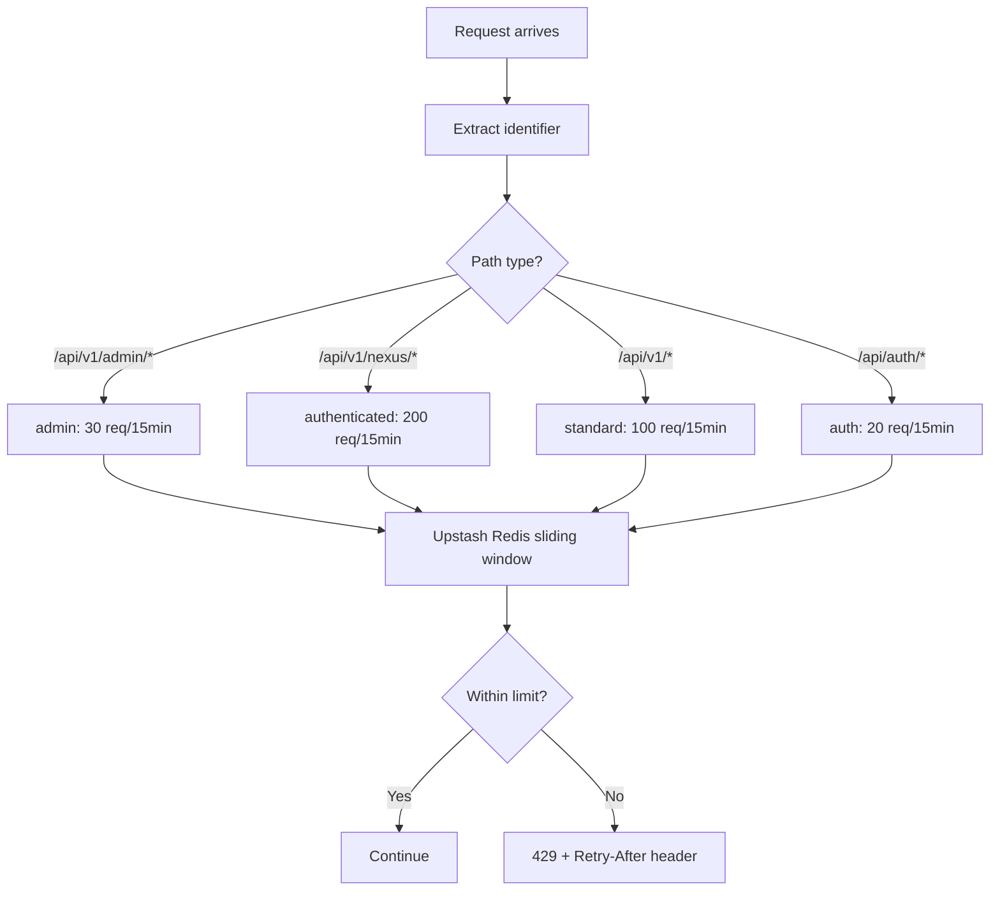

| Endpoint Pattern | Limit | Window | Identifier |
|-----------------|-------|--------|------------|
| `/api/v1/*` | 100 | 15 min | IP address |
| `/api/v1/nexus/*` | 200 | 15 min | IP address |
| `/api/v1/admin/*` | 30 | 15 min | IP address |
| `/api/auth/*` | 20 | 15 min | IP address |
| `/api/v1/webhooks/*` | N/A | N/A | Stripe signature only |

**Implementation:** Upstash Redis sliding window ผ่าน `@upstash/ratelimit` library ใน `@nexus/cache` package

**Headers ที่ส่งกลับทุก API response:**

| Header | Description |
|--------|-------------|
| `X-RateLimit-Limit` | Maximum requests per window |
| `X-RateLimit-Remaining` | Requests remaining |
| `X-RateLimit-Reset` | Unix timestamp of window reset |
| `Retry-After` | Seconds until reset (429 only) |

### 7.4 Secret Management

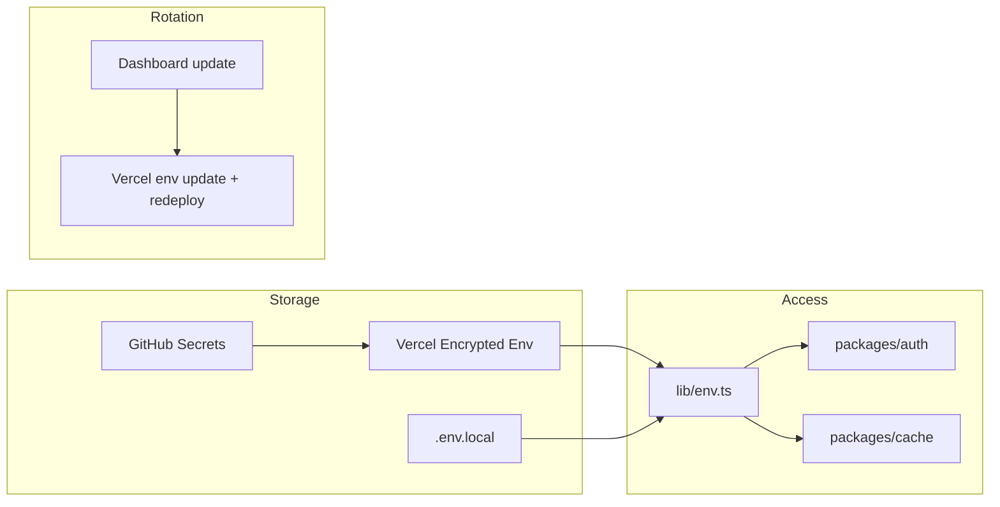

| Secret | Storage | วิธีหมุนเวียน |
|--------|---------|---------------|
| `AUTH_SECRET` | Vercel env | สร้างใหม่ → redeploy (ยกเลิกทุก sessions) |
| `DATABASE_URL` | Vercel env | Neon dashboard → update env → redeploy |
| `AUTH_GOOGLE_ID/SECRET` | Vercel env | Google Cloud Console → update env → redeploy |
| `STRIPE_SECRET_KEY` | Vercel env | Stripe dashboard → update env → redeploy |
| `STRIPE_WEBHOOK_SECRET` | Vercel env | Stripe dashboard → update env → redeploy |
| `RESEND_API_KEY` | Vercel env | Resend dashboard → update env → redeploy |
| `UPSTASH_REDIS_REST_TOKEN` | Vercel env | Upstash dashboard → update env → redeploy |
| `R2_ACCESS_KEY_ID/SECRET` | Vercel env | Cloudflare dashboard → update env → redeploy |

**Prohibited:**
- Secrets ใน source code, commit history, client bundles, SSR props, หรือ CI workflow files
- `NEXT_PUBLIC_` prefix บน secret ใดๆ

### 7.5 Encryption

| Layer | In Transit | At Rest |
|-------|-----------|---------|
| Client ↔ Edge | TLS 1.3 (Cloudflare) | N/A |
| Edge ↔ Middleware | TLS 1.3 | N/A |
| Application ↔ Database | TLS 1.3 (Neon) | AES-256 (Neon managed) |
| Application ↔ Redis | TLS 1.3 (Upstash) | Upstash managed |
| Application ↔ R2 | TLS 1.3 | AES-256 (Cloudflare managed) |
| Database backups | TLS | AES-256 (Neon PITR) |
| Passwords | TLS | bcrypt hash (12 rounds) |
| JWT signing | N/A | HMAC-SHA256 with 32-byte `AUTH_SECRET` |

### 7.6 Audit Logging

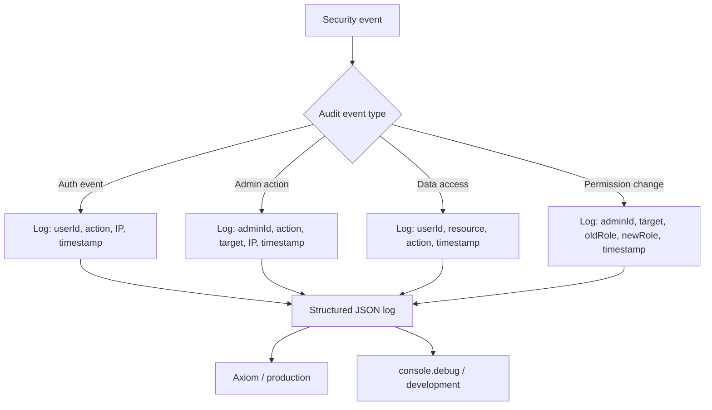

**Events ที่ถูก log:**

| Event | Fields | Retention |
|-------|--------|-----------|
| Login success | userId, IP, userAgent, timestamp | 90 วัน |
| Login failure | email, IP, reason, timestamp | 90 วัน |
| Logout | userId, timestamp | 90 วัน |
| Password change | userId, timestamp | 90 วัน |
| Password reset request | email, IP, timestamp | 90 วัน |
| Role change | adminId, targetUserId, oldRole, newRole, timestamp | 1 ปี |
| Account suspension | adminId, targetUserId, reason, timestamp | 1 ปี |
| Admin content edit | adminId, resourceType, resourceId, action, timestamp | 1 ปี |
| Subscription change | userId, plan, action, timestamp | 1 ปี |
| Session revocation | userId, jti, reason | 90 วัน |

**Log format (structured JSON):**

```json
{
  "type": "audit",
  "event": "login_success",
  "userId": "uuid-123",
  "ip": "203.0.113.42",
  "userAgent": "Mozilla/5.0...",
  "timestamp": "2026-06-25T10:30:00.000Z",
  "requestId": "req_abc123"
}
```

### 7.7 Incident Response

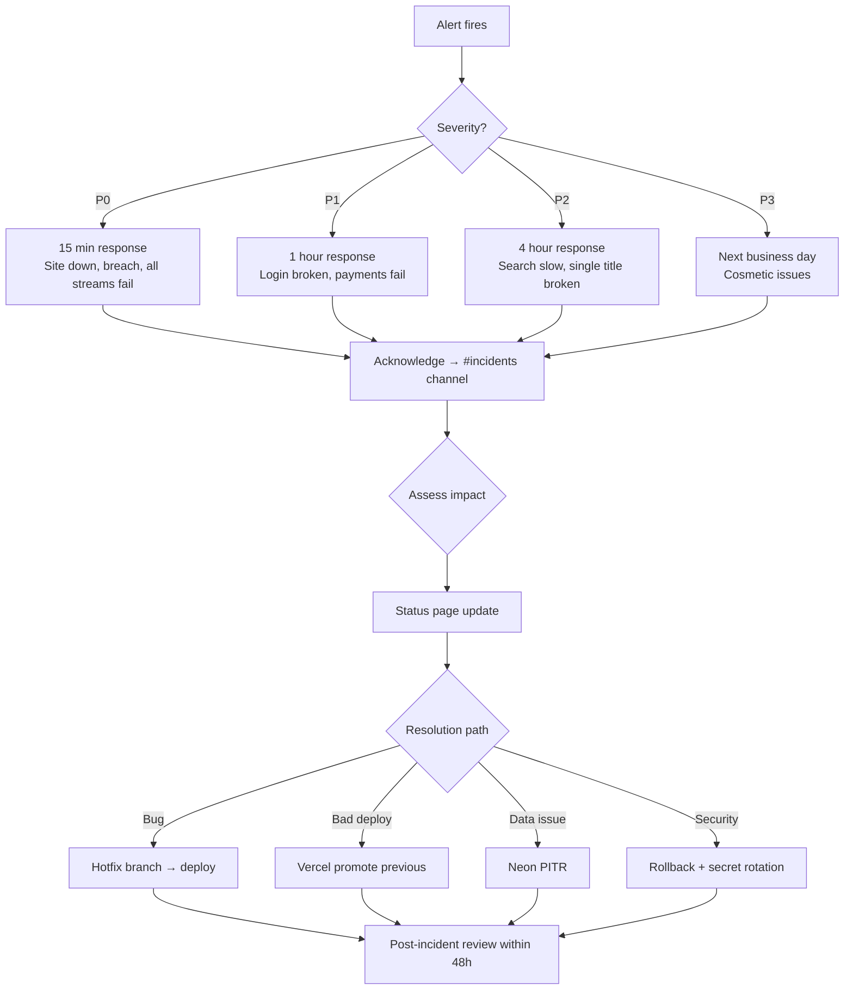

**Security-specific playbooks:**

| สถานการณ์ | Response | เวลา |
|----------|----------|------|
| Credential leak detected | หมุนเวียน secret ที่ได้รับผลกระทบ ยกเลิกทุก sessions บังคับรีเซ็ตรหัสผ่านผู้ใช้ที่ได้รับผลกระทบ | < 1 ชั่วโมง |
| Account takeover สงสัย | ระงับบัญชี แจ้งผู้ใช้ สืบสวน audit logs | < 30 นาที |
| SQL injection attempt | บล็อก IP ผ่าน Cloudflare WAF สืบสวน แพถถ้าจำเป็น | < 15 นาที |
| รูปแบบการรับส่งข้อมูลผิดปกติ | เปิด Cloudflare "I'm Under Attack" mode สืบสวน | < 15 นาที |
| Data breach ยืนยัน | เปิด incident response แจ้งผู้ใช้ที่ได้รับผลกระทบตาม GDPR/CCPA ติดต่อทนายความ | < 72 ชั่วโมง (ข้อกำหนดทางกฎหมาย) |

---

## 8. Implementation Guidance

### 8.1 Sprint S4 Deliverables

| Deliverable | File(s) | Sprint |
|-------------|---------|--------|
| `@nexus/auth` package scaffold | `packages/auth/` | S4 |
| Auth.js config (credentials + Google) | `packages/auth/src/config.ts` | S4 |
| Auth route handler | `apps/web/app/api/auth/[...nextauth]/route.ts` | S4 |
| Session guards | `packages/auth/src/guards.ts` | S4 |
| Middleware auth integration | `apps/web/middleware.ts` | S4 |
| Login page | `apps/web/app/(auth)/login/page.tsx` | S4 |
| Register page | `apps/web/app/(auth)/register/page.tsx` | S4 |
| Forgot password page | `apps/web/app/(auth)/forgot-password/page.tsx` | S4 |
| Email verification flow | `apps/web/app/(auth)/verify-email/page.tsx` | S4 |
| Resend email integration | `packages/email/` | S4 |
| Password reset token table | `packages/db/src/schema/password-reset-tokens.ts` | S4 |
| Auth integration tests | `apps/web/__tests__/api/auth.test.ts` | S4 |

### 8.2 Sprint S5 Deliverables (Billing Integration)

| Deliverable | File(s) | Sprint |
|-------------|---------|--------|
| Subscription gate in middleware | `apps/web/middleware.ts` | S5 |
| Stripe webhook handler | `apps/web/app/api/v1/webhooks/stripe/route.ts` | S5 |
| Subscription status cache | `packages/cache/src/domains/subscription.ts` | S5 |
| Billing service | `apps/web/features/billing/services/billing-service.ts` | S5 |

### 8.3 Middleware Final State (S5)

```typescript
// apps/web/middleware.ts — final implementation
import { NextResponse } from "next/server";
import type { NextRequest } from "next/server";
import { consumeRateLimit } from "@nexus/cache/rate-limit";
import { getSession } from "@nexus/auth";

export async function middleware(request: NextRequest) {
  const { pathname } = request.nextUrl;

  // 1. Session resolution (always)
  const session = await getSession(request);

  // 2. Rate limiting (API routes)
  if (pathname.startsWith("/api/v1/")) {
    const ip = request.headers.get("x-forwarded-for")?.split(",")[0]?.trim() ?? "unknown";
    const limiterKey = pathname.startsWith("/api/v1/admin/")
      ? "admin"
      : session?.user ? "authenticated" : "standard";
    const result = await consumeRateLimit(limiterKey, ip);
    if (!result.success) {
      return NextResponse.json(
        { error: { code: "RATE_LIMITED", message: "Too many requests", details: [] },
          meta: { requestId: crypto.randomUUID(), version: "v1" } },
        { status: 429, headers: {
          "X-RateLimit-Limit": String(result.limit),
          "X-RateLimit-Remaining": String(result.remaining),
          "X-RateLimit-Reset": String(result.reset),
          "Retry-After": String(Math.ceil((result.reset - Date.now()) / 1000)),
        }},
      );
    }
  }

  // 3. Auth redirect (protected pages)
  if (pathname.startsWith("/nexus/") || pathname.startsWith("/settings/")) {
    if (!session?.user) {
      return NextResponse.redirect(
        new URL(`/login?callbackUrl=${encodeURIComponent(request.url)}`, request.url),
      );
    }
  }

  // 4. Subscription gate (watch pages)
  if (pathname.startsWith("/nexus/watch/") || pathname.startsWith("/title/") && pathname.includes("/watch/")) {
    if (!session?.user) {
      return NextResponse.redirect(new URL("/login", request.url));
    }
    // Subscription check via Redis cache
    const { getCachedSubscriptionStatus } = await import("@nexus/cache/domains/subscription");
    const status = await getCachedSubscriptionStatus(session.user.id);
    if (status !== "active" && status !== "trialing") {
      return NextResponse.redirect(new URL("/pricing", request.url));
    }
  }

  // 5. Admin guard
  if (pathname.startsWith("/admin/")) {
    if (!session?.user || (session.user.role !== "admin" && session.user.role !== "superadmin")) {
      return NextResponse.redirect(new URL("/login", request.url));
    }
  }

  // 6. Security headers
  const response = NextResponse.next();
  response.headers.set("X-Content-Type-Options", "nosniff");
  response.headers.set("X-Frame-Options", "DENY");
  response.headers.set("Referrer-Policy", "strict-origin-when-cross-origin");
  response.headers.set("Permissions-Policy", "camera=(), microphone=(), geolocation=()");
  response.headers.set(
    "Content-Security-Policy",
    "default-src 'self'; script-src 'self'; style-src 'self' 'unsafe-inline'; img-src 'self' data: https://cdn.nexusanime.com; font-src 'self'; connect-src 'self'; frame-ancestors 'none';",
  );
  return response;
}

export const config = {
  matcher: ["/((?!_next/static|_next/image|favicon.ico|.*\\.(?:svg|png|jpg|jpeg|gif|webp)$).*)"],
};
```

### 8.4 Database Schema Additions

```sql
-- Password reset tokens (S4)
CREATE TABLE password_reset_tokens (
    id uuid PRIMARY KEY DEFAULT gen_random_uuid(),
    user_id uuid NOT NULL REFERENCES users(id) ON DELETE CASCADE,
    token_hash varchar(255) NOT NULL,  -- SHA-256 of raw token
    expires_at timestamptz NOT NULL,
    used_at timestamptz,
    created_at timestamptz NOT NULL DEFAULT now()
);

CREATE INDEX idx_password_reset_tokens_hash ON password_reset_tokens(token_hash);
CREATE INDEX idx_password_reset_tokens_user ON password_reset_tokens(user_id);

-- OAuth accounts (S4 — Auth.js requires this)
CREATE TABLE accounts (
    id uuid PRIMARY KEY DEFAULT gen_random_uuid(),
    user_id uuid NOT NULL REFERENCES users(id) ON DELETE CASCADE,
    provider varchar(255) NOT NULL,       -- 'google', 'credentials'
    provider_account_id varchar(255) NOT NULL,
    refresh_token text,
    access_token text,
    expires_at integer,
    token_type text,
    scope text,
    id_token text,
    session_state text,
    created_at timestamptz NOT NULL DEFAULT now(),
    updated_at timestamptz NOT NULL DEFAULT now(),
    UNIQUE(provider, provider_account_id)
);

-- Verification tokens (S4)
CREATE TABLE verification_tokens (
    id uuid PRIMARY KEY DEFAULT gen_random_uuid(),
    user_id uuid NOT NULL REFERENCES users(id) ON DELETE CASCADE,
    token_hash varchar(255) NOT NULL,
    expires_at timestamptz NOT NULL,
    created_at timestamptz NOT NULL DEFAULT now()
);

CREATE INDEX idx_verification_tokens_hash ON verification_tokens(token_hash);

-- Session revocation list (S4 — for logout before expiry)
CREATE TABLE revoked_sessions (
    jti varchar(255) PRIMARY KEY,
    user_id uuid NOT NULL REFERENCES users(id) ON DELETE CASCADE,
    revoked_at timestamptz NOT NULL DEFAULT now(),
    expires_at timestamptz NOT NULL  -- for cleanup
);

CREATE INDEX idx_revoked_sessions_user ON revoked_sessions(user_id);
CREATE INDEX idx_revoked_sessions_expires ON revoked_sessions(expires_at);
```

### 8.5 Environment Variables (S4 Additions)

```bash
# ── Auth (S4) ──────────────────────────────────────────
AUTH_SECRET=            # openssl rand -base64 32
AUTH_URL=http://localhost:3000
AUTH_GOOGLE_ID=
AUTH_GOOGLE_SECRET=

# ── Email (S4) ─────────────────────────────────────────
RESEND_API_KEY=
EMAIL_FROM=noreply@nexusanime.com
```

### 8.6 Configuration Reference

**`packages/auth/src/config.ts` — Auth.js v5 Configuration:**

```typescript
// packages/auth/src/config.ts
import NextAuth from "next-auth";
import Google from "next-auth/providers/google";
import Credentials from "next-auth/providers/credentials";
import { DrizzleAdapter } from "@auth/drizzle-adapter";
import { db } from "@nexus/db";
import { loginSchema } from "@nexus/validation";

export const { handlers, signIn, signOut, auth } = NextAuth({
  adapter: DrizzleAdapter(db),
  providers: [
    Google({
      clientId: process.env.AUTH_GOOGLE_ID,
      clientSecret: process.env.AUTH_GOOGLE_SECRET,
    }),
    Credentials({
      credentials: {
        email: {},
        password: {},
      },
      authorize: async (credentials) => {
        const parsed = loginSchema.safeParse(credentials);
        if (!parsed.success) return null;

        const user = await authenticateUser(parsed.data.email, parsed.data.password);
        return user;
      },
    }),
  ],
  session: { strategy: "jwt" },
  cookies: {
    sessionToken: {
      name: "__Host-nexus-session",
      options: {
        httpOnly: true,
        secure: true,
        sameSite: "lax",
        path: "/",
      },
    },
  },
  callbacks: {
    async jwt({ token, user }) {
      if (user) {
        token.role = user.role;
        token.sub = user.id;
      }
      return token;
    },
    async session({ session, token }) {
      session.user.id = token.sub!;
      session.user.role = token.role;
      return session;
    },
  },
});
```

---

## 9. Risks & Mitigations

### 9.1 Risk Register

| # | Risk | Severity | Likelihood | Mitigation |
|---|------|----------|------------|------------|
| R1 | `AUTH_SECRET` compromise | Critical | Low | Rotate secret immediately via Vercel dashboard; force password reset for all users; all sessions invalidated automatically |
| R2 | Session theft via XSS | Critical | Low | CSP headers, `HttpOnly` cookie, React auto-escaping, input sanitization, no sensitive data in localStorage |
| R3 | Credential stuffing attack | High | Medium | Rate limiting on `/api/auth/*` (20/15min), generic "Invalid email or password", no user enumeration, bcrypt with 12 rounds |
| R4 | OAuth account hijacking | High | Low | PKCE enabled, state parameter validation, account linking requires matching email, Google email verification |
| R5 | CSRF attack on mutations | Medium | Low | SameSite=Lax cookie, CSRF token, `__Host-` prefix, Origin header validation |
| R6 | JWT brute force | Low | Very Low | HMAC-SHA256 with 32+ byte secret, 30-day expiration, JTI blacklisting for early revocation |
| R7 | Session enumeration | Medium | Low | Generic error messages (no "user not found" vs "wrong password"), same response time for all error paths |
| R8 | Rate limit bypass | Medium | High | IP-based with `X-Forwarded-For` header, sliding window algorithm, authenticated sessions have higher limits |
| R9 | Database credential leak | Critical | Low | Neon managed database with TLS, PITR backups, no direct public access, connection string rotation |
| R10 | Dependency vulnerability | Medium | Medium | Weekly Renovate updates, pnpm audit in CI, dependency pinning with caret (^) for runtime, lockfile frozen in CI |
| R11 | Email delivery failure | Medium | Low | Resend provider, retry logic, email verification queue, fallback email provider for S9 |
| R12 | OAuth provider outage | Medium | Medium | Credentials login as primary, OAuth as secondary, circuit breaker pattern, graceful degradation |

### 9.2 Threat Model

#### STRIDE Analysis

| Threat | Countermeasure |
|--------|---------------|
| **Spoofing** | Multi-layer auth (JWT + CSRF + Origin), bcrypt password verification, OAuth state/PKCE |
| **Tampering** | JWT signature validation, TLS 1.3 everywhere, parameterized queries, CSP |
| **Repudiation** | Structured audit logs (JSON), timestamps, IP, user agent, requestId for tracing |
| **Information Disclosure** | CSP, no secrets in client, generic error messages, HttpOnly cookies, encrypted at rest |
| **Denial of Service** | Rate limiting, Cloudflare WAF/DDoS, autoscaling on Vercel, short cache TTLs |
| **Elevation of Privilege** | RBAC guards, resource ownership checks, least privilege for API keys, role hierarchy |

### 9.3 Security Checklist (Pre-Launch)

- [ ] `AUTH_SECRET` generated with `openssl rand -base64 32` (32+ bytes)
- [ ] All OAuth providers configured with proper callback URLs
- [ ] CSP headers deployed and tested with multiple browsers
- [ ] Rate limiting active on all API routes with proper headers
- [ ] `__Host-` prefix present on all session cookies
- [ ] HTTPS-only enforced (no HTTP access in production)
- [ ] Database connections use TLS (Neon requires this)
- [ ] Audit logging active and writing to production log aggregator
- [ ] Incident response runbook written and reviewed
- [ ] Password reset flow tested (token expiry, invalidation)
- [ ] Account linking tested (OAuth to credentials merge)
- [ ] Security headers verified with headerscan.com or similar

---

## 10. Future Considerations

### 10.1 Multi-Factor Authentication (MFA)

**Status:** Planned for Sprint 7+

ในรุ่นถัดไป ระบบรับรองตัวตนจะรองรับ Multi-factor authentication (MFA) เพื่อเพิ่มความปลอดภัยสำหรับผู้ใช้ที่ต้องการป้องกันเพิ่มเติม

**Implementation approach:**
- TOTP (Time-based One-Time Password) ผ่าน `otplib` library
- Backup codes สำหรับการกู้คืนเมื่ออุปกรณ์สูญหาย
- MFA setup flow ในหน้า `/settings/security`
- MFA enforcement สำหรับ admin/superadmin roles

**Database schema addition:**

```sql
CREATE TABLE user_mfa (
    id uuid PRIMARY KEY DEFAULT gen_random_uuid(),
    user_id uuid UNIQUE NOT NULL REFERENCES users(id) ON DELETE CASCADE,
    totp_secret varchar(255),  -- encrypted
    backup_codes jsonb,        -- encrypted array of 10 codes
    is_enabled boolean NOT NULL DEFAULT false,
    created_at timestamptz NOT NULL DEFAULT now(),
    updated_at timestamptz NOT NULL DEFAULT now()
);
```

### 10.2 Single Sign-On (SSO) / SAML

**Status:** Planned for Enterprise tier (Sprint 10+)

สำหรับลูกค้าองค์กร (Enterprise) ระบบจะรองรับ SAML 2.0 SSO เพื่อให้ผู้ใช้เข้าสู่ระบบด้วย corporate credentials

**Implementation approach:**
- SAML 2.0 ผ่าน `@node-saml/node-saml` library
- Support for Okta, Azure AD, Google Workspace
- Just-in-time (JIT) provisioning สำหรับผู้ใช้ใหม่
- Role mapping จาก SAML attributes

### 10.3 Passkeys / WebAuthn

**Status:** Planned for Sprint 8+

ระบบจะรองรับ FIDO2/WebAuthn passkeys เพื่อให้ผู้ใช้เข้าสู่ระบบโดยไม่ต้องใช้รหัสผ่าน (passwordless)

**Implementation approach:**
- WebAuthn ผ่าน `@simplewebauthn/server` library
- Platform authenticator support (Touch ID, Face ID, Windows Hello)
- Cross-device authentication flow
- Fallback to password + MFA สำหรับ recovery

### 10.4 Advanced Session Management

**Status:** Planned for Sprint 9+

- **Device fingerprinting** — ตรวจจับอุปกรณ์ที่เข้าสู่ระบบ แสดงรายการ active sessions ให้ผู้ใช้ดู
- **Concurrent session limits** — จำกัดจำนวน session พร้อมกัน (เช่น 5 devices)
- **Geo-location anomaly detection** — แจ้งเตือนเมื่อมีการเข้าสู่จากพื้นที่ผิดปกติ
- **Forced logout** — ผู้ใช้สามารถบังคับ logout จากอุปกรณ์อื่นได้

### 10.5 Enhanced Authorization

**Status:** Planned for Sprint 10+

- **Attribute-Based Access Control (ABAC)** — นอกเหนือจาก RBAC แบบเดิม รองรับเงื่อนไขซับซ้อน เช่น "ผู้ใช้ที่มี subscription และอายุ > 18 ปี"
- **Resource-level permissions** — ระบบ share watchlist แบบ granular (read-only, edit, admin)
- **API scopes** — สำหรับ third-party integrations ในอนาคต

### 10.6 Security Enhancements

**Status:** Ongoing

- **HSM (Hardware Security Module)** สำหรับเก็บ signing keys ในระดับ Enterprise
- **Automated penetration testing** — รัน quarterly ผ่าน third-party vendor
- **Bug bounty program** — เปิดให้ security researchers รายงานช่องโหว่
- **SOC 2 Type II compliance** — สำหรับ Enterprise tier
- **Real-time threat detection** — วิเคราะห์ patterns ผิดปกติด้วย ML

---

## 11. References

- [M2.1 — Backend Architecture](backend-architecture.md) — Section 10 (Security Boundaries)
- [M2.2 — Database Design](../database-design.md) — `users` table schema
- [M2.5 — Redis Strategy](../redis-strategy.md) — Section 9 (Session & Auth Caching)
- [M2.6 — Environment Strategy](../environment-specification.md) — Section 4.2 (Authentication variables)
- [API Specification](../api-specification.md) — Section 2 (Authentication endpoints)
- [Master Roadmap](../master-roadmap.md) — Section 3.6 (Security Architecture summary)
- [Auth.js v5 Documentation](https://authjs.dev/)
- [Upstash Redis REST SDK](https://upstash.com/docs/redis/sdks/javascriptsdk/overview)
- [OWASP Authentication Cheat Sheet](https://cheatsheetseries.owasp.org/cheatsheets/Authentication_Cheat_Sheet.html)

---

*This document is the authoritative reference for the Nexus Anime authentication architecture. All auth flows, session handling, authorization guards, and security controls must conform to this specification.*
