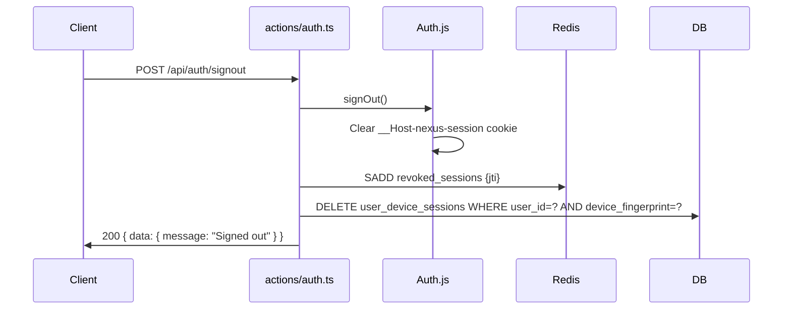
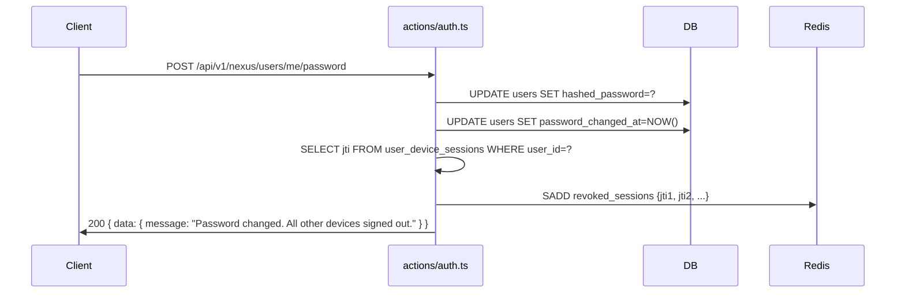

# M3.3 — Session & Token Strategy

> **Scope:** This document defines the **session and token strategy for Nexus Anime** — JWT structure, token issuance, rolling refresh, session expiration, Remember Me, device tracking, concurrent session limits, logout flows, and token revocation. It is the authoritative design reference for all session and token concerns.

> **Status:** Draft — Pending Review
> **Date:** 2026-06-25
> **Author:** Tech Lead
> **Milestone:** M3 (Sprints 4–5)

---

## Table of Contents

1. [Purpose & Relationship to M2.7](#1-purpose--relationship-to-m27)
2. [JWT Strategy](#2-jwt-strategy)
3. [Refresh Token Strategy](#3-refresh-token-strategy)
4. [Session Expiration](#4-session-expiration)
5. [Remember Me](#5-remember-me)
6. [Device Tracking](#6-device-tracking)
7. [Logout Flow](#7-logout-flow)
8. [Token Revocation](#8-token-revocation)
9. [Database Schema](#9-database-schema)
10. [Environment Variables](#10-environment-variables)
11. [Sprint Deliverables](#11-sprint-deliverables)
12. [References](#12-references)

---

## 1. Purpose & Relationship to M2.7

### 1.1 Purpose

M3.3 is the authoritative specification for **session lifecycle and token strategy** in Nexus Anime. It details how session tokens are structured, issued, validated, refreshed, revoked, and cleaned up — plus the extensions (Remember Me, device tracking, concurrent session limits) that layer on top of the base auth flows defined in M2.7.

### 1.2 Relationship to M2.7

M2.7 ([Authentication Architecture](authentication-architecture.md)) remains authoritative for **auth flows** (sign-up, login, OAuth, password reset), **RBAC** (roles, guards), **trust boundaries** (CSRF, CORS, rate limiting), and **security architecture** (secret management, audit logging).

M3.3 owns everything **session & token**. It references M2.7 for the flows that produce tokens, but owns the token structure itself.

### 1.3 Scope Matrix

| Topic | Owner | Document |
|-------|-------|----------|
| JWT claims structure & versioning | **M3.3** | This document §2 |
| Token issuance & rolling sessions | **M3.3** | This document §3 |
| Refresh token strategy | **M3.3** | This document §3 |
| Session expiration policy | **M3.3** | This document §4 |
| Remember Me flow | **M3.3** | This document §5 |
| Device fingerprinting & tracking | **M3.3** | This document §6 |
| Concurrent session limits | **M3.3** | This document §6 |
| Token revocation (JTI blacklist) | **M3.3** | This document §8 |
| Logout flows (self, admin-forced, password-change) | **M3.3** | This document §7 |
| Session cleanup jobs | **M3.3** | This document §8 |
| Auth flows (login/register/OAuth) | M2.7 | [authentication-architecture.md](authentication-architecture.md) |
| RBAC / guards | M2.7 | [authentication-architecture.md](authentication-architecture.md) |
| Trust boundaries / CSRF / CORS | M2.7 | [authentication-architecture.md](authentication-architecture.md) |
| Subscription status caching | M2.5 | [redis-strategy.md](../redis-strategy.md) |
| User entities & relationships | M3.2 | [user-domain-design.md](../user-domain-design.md) |

---

## 2. JWT Strategy

### 2.1 Token Structure

Single JWT in HTTP-only cookie (`__Host-nexus-session`). Access and refresh are **derived from the same JWT** — refresh is a re-signing event, not a separate credential.

```typescript
interface SessionJWT {
  // Registered claims (RFC 7519)
  sub: string;              // user ID (UUID)
  iat: number;             // issued at (seconds since epoch)
  exp: number;             // expiration (seconds since epoch)
  jti: string;             // unique token ID (UUID, for revocation)

  // Public claims (Nexus-specific)
  v: number;               // token version — bumped on claims schema changes
  channel: "credentials" | "google" | "discord";  // auth method

  // Private claims (Nexus-specific)
  email: string;
  role: "user" | "admin" | "superadmin";
  email_verified: boolean;
  name: string | null;
  image: string | null;
  device_id: string | null;  // device fingerprint (null if not tracked)
}
```

**Why single JWT with version claim?**

- Simpler than access/refresh token pairs — no refresh endpoint to secure, no refresh token rotation table.
- `v` claim allows migrating claims schema without breaking existing tokens (validation ignores unknown versions when `v` is recognized).
- JTI enables per-token revocation (logout before expiry).

### 2.2 Signing & Verification

| Concern | Value |
|---------|-------|
| Algorithm | `HS256` (HMAC-SHA256) — Auth.js default, sufficient for symmetric secret |
| Secret | `AUTH_SECRET` — 32+ bytes from `openssl rand -base64 32` |
| Rotation | Rotate via Vercel dashboard → redeploy. All sessions invalidated. |
| Verify steps | 1) Extract cookie → 2) Verify signature → 3) Check `exp > now` → 4) Check `iat` within 30-day window → 5) Check JTI not in `revoked_sessions` |

### 2.3 Token Versioning

| Version | Changes |
|---------|---------|
| `v: 1` | Initial schema (§2.1) |

When `v` must change (e.g., adding `tenant_id` post-MVP), Auth.js `jwt` callback bumps the claim. Old tokens with stale `v` are accepted at verification but re-signed at next refresh. Tokens with unrecognized `v` are rejected.

### 2.4 Why Not Separate Access + Refresh Tokens?

| Concern | Single JWT | Access + Refresh |
|---------|-----------|-----------------|
| Simplicity | ✅ One token, one cookie | ❌ Two tokens, refresh endpoint |
| Revocation granularity | ✅ JTI per token | ✅ Same |
| Offline replay resistance | ✅ Same (30-day TTL) | ✅ Short-lived access better |
| DB load | ✅ Stateless | ❌ Refresh record per user |
| Auth.js alignment | ✅ Native | ❌ Requires custom adapter |

For a stateless JWT architecture (M2.6 resolved decision), a single JWT with rolling refresh is the right fit. Separate refresh tokens become viable only when we need short-lived access (< 15 min) — flagged for post-MVP evaluation.

---

## 3. Refresh Token Strategy

### 3.1 Rolling Session Rules

| Parameter | Value | Rationale |
|-----------|-------|-----------|
| Token TTL | 30 days | Match M2.7 "30-day rolling" policy |
| Refresh threshold | Re-sign when `exp - now < 7 days` | User inactive > 23 days → re-auth required on next visit |
| Refresh trigger | Auth.js `jwt` callback | Runs on every authenticated request (no dedicated endpoint) |
| Cookie update | New `Set-Cookie` on refresh | Browser updates expiration |

### 3.2 Auth.js `jwt` Callback

```typescript
async jwt({ token, user }) {
  // Initial sign-in: populate claims
  if (user) {
    token.sub = user.id;
    token.role = user.role;
    token.email = user.email;
    token.email_verified = !!user.emailVerified;
    token.name = user.name;
    token.image = user.image;
    token.channel = user.channel;
    token.device_id = user.device_id ?? null;
    token.v = TOKEN_VERSION;
  }

  // Rolling refresh
  const expiresIn = (token.exp as number) - Math.floor(Date.now() / 1000);
  if (expiresIn < 7 * 86400) {
    token.exp = Math.floor(Date.now() / 1000) + 30 * 86400;
    token.iat = Math.floor(Date.now() / 1000);
    token.jti = crypto.randomUUID();  // new token ID after rotation
  }

  return token;
}
```

### 3.3 Auth.js `session` Callback

Maps token claims into the `session` object exposed to server and client code:

```typescript
async session({ session, token }) {
  session.user.id = token.sub!;
  session.user.email = token.email!;
  session.user.role = token.role as "user" | "admin" | "superadmin";
  session.user.name = token.name;
  session.user.image = token.image;
  session.user.emailVerified = token.email_verified;
  session.user.deviceId = token.device_id;
  session.expires = new Date((token.exp as number) * 1000).toISOString();
  return session;
}
```

### 3.4 Session Exposed to Client

`useSession()` / `getSession()` returns only non-sensitive claims. **Never** expose `jti` or raw JWT to client.

```typescript
// Safe client-facing session shape
{
  user: { id, email, name, role, image, emailVerified },
  expires: string  // ISO 8601
}
```

### 3.5 Refresh Edge Cases

| Scenario | Behavior |
|----------|----------|
| Request with expired JWT (`exp < now`) | 302 → `/login?callbackUrl=...` |
| Request with JWT past 30-day absolute window (`iat > 30 days ago`) | 302 → `/login` |
| Request with valid but soon-expiring JWT (`< 7 days`) | Re-sign + new cookie in response |
| Request with revoked JTI | 302 → `/login` |
| Multiple concurrent requests with same about-to-expire JWT | Each gets fresh cookie; last write wins (harmless) |

---

## 4. Session Expiration

### 4.1 Expiration Matrix

| Scenario | TTL | Trigger | Mechanism |
|----------|-----|---------|-----------|
| **Idle timeout** | 30 days from last auth event | Inactivity | JWT `exp` claim |
| **Absolute max** | 30 days (rolling window) | `iat` older than 30 days → force re-auth | Middleware check: `now - iat > 30 days` |
| **Remember Me** | 365 days | User opts in at login | Extended `exp` + persistent cookie (§5) |
| **Password change** | Immediate | User changes password | All user JTIs blacklisted |
| **Logout** | Immediate | User signs out | Clear cookie + JTI blacklist |
| **Account suspension** | Immediate | Admin action | All user JTIs blacklisted |
| **Account deletion** | Immediate | Soft-delete user | All user JTIs blacklisted |
| **Token version rotation** | On re-sign | Auth.js `jwt` callback | New `v` mismatch → re-sign |
| **`AUTH_SECRET` rotation** | Immediate | Secret change in Vercel | All signatures invalid |

### 4.2 Absolute-Max Enforcement

Even with rolling refresh, a user returning after 30 days of inactivity must re-authenticate. The middleware enforces this via the `iat` claim:

```typescript
// middleware.ts
const iat = token.iat as number;
const age = Math.floor(Date.now() / 1000) - iat;
const ABSOLUTE_MAX = 30 * 86400; // 30 days

if (age > ABSOLUTE_MAX) {
  return NextResponse.redirect(new URL("/login", request.url));
}
```

### 4.3 Token Revocation Lifecycle (JTI Blacklist)

- On logout / password change / suspension: insert JTI into `revoked_sessions`.
- On every authenticated request: check `revoked_sessions` for the JTI.
- Cleanup: cron deletes expired `revoked_sessions` rows (> 30 days old).

### 4.4 Session Expiration Client UX

| Event | Client Behavior |
|-------|-----------------|
| Session expired at next request | `useSession()` returns `null` → redirect to `/login` |
| Session expired during inactivity (SPA) | Next API call returns 401 → client calls `signIn()` |
| Session refreshed silently | Invisible to user |

---

## 5. Remember Me

### 5.1 Requirements

When the user checks "Remember Me" at login:
- Session persists across browser closes
- Extended idle timeout (365 days vs 30 days)
- Visually distinguishable in device list

### 5.2 Implementation

Two separate cookies to distinguish Remember-Me sessions:

| Cookie | Remember Me OFF | Remember Me ON |
|--------|-----------------|----------------|
| `__Host-nexus-session` | 30-day rolling | 30-day rolling (auth) |
| `__Host-nexus-remember` | Not set | 365-day persistent (flags "remember me") |

**Login flow with Remember Me:**

```typescript
// actions/auth.ts (login action)
const formData = await request.formData();
const remember = formData.get("remember") === "on";

// Sign in with Auth.js (always issues 30-day session)
await signIn("credentials", { email, password, redirect: false });

// If remember-me, issue extended cookie
if (remember) {
  const token = await createRememberMeToken(user.id); // JTI + user hash, 365-day exp
  cookies.set("__Host-nexus-remember", token, {
    httpOnly: true,
    secure: true,
    sameSite: "lax",
    path: "/",
    maxAge: 365 * 86400,
  });
}
```

### 5.3 Absolute-Max with Remember Me

The 30-day absolute-max (`iat` check) still applies even with Remember Me. If a user returns after 30 days, they must re-authenticate even if the Remember Me cookie is still valid:

```typescript
// middleware.ts
if (!session?.user) {
  // Check if remember-me cookie exists → auto-login if valid
  const rememberToken = request.cookies.get("__Host-nexus-remember")?.value;
  if (rememberToken && isRememberMeTokenValid(rememberToken)) {
    await autoLoginFromRememberMe(rememberToken);
    // User now has fresh 30-day session
    continue;
  }
  return redirect("/login");
}
```

### 5.4 Remember Me Token Validation

```typescript
// packages/auth/src/remember-me.ts
interface RememberMeToken {
  user_id: string;
  token_hash: string;    // HMAC-SHA256 of a random UUID
  device_id: string;     // device fingerprint
  iat: number;
  exp: number;
}
```

- Stored as **a JWT signed with `AUTH_SECRET`** (separate from session JWT).
- Validated on auto-login: signature + expiry + `user_id` not suspended + `device_id` matches.
- On logout: both cookies cleared.
- Valid for 365 days, single-use: re-issue on successful auto-login.

### 5.5 Revocation

| Action | Impact on Remember Me |
|--------|----------------------|
| Logout | Both cookies cleared |
| Password change | All remember-me tokens invalidated |
| Account suspension | All tokens invalidated |
| `AUTH_SECRET` rotation | All tokens invalid (signature changed) |

---

## 6. Device Tracking

### 6.1 Requirements

- Track which devices are logged into an account
- Allow users to view and revoke sessions per device
- Detect new-device logins for security alerts
- Support concurrent session limits

### 6.2 Device Fingerprint

Computed at login from request metadata. **Not** a cryptographic fingerprint — a heuristic composite:

```typescript
// packages/auth/src/device.ts
interface DeviceFingerprint {
  userAgent: string;       // User-Agent header
  acceptLanguage: string;  // Accept-Language header
  ipSubnet: string;        // /24 subnet of X-Forwarded-For IP
}

function computeDeviceFingerprint(req: NextRequest): string {
  const ua = req.headers.get("user-agent") ?? "";
  const lang = req.headers.get("accept-language") ?? "";
  const ip = req.headers.get("x-forwarded-for")?.split(",")[0]?.trim() ?? "unknown";
  const subnet = ip.split(".").slice(0, 3).join(".") + ".0/24";

  const raw = `${ua}|${lang}|${subnet}`;
  return createHash("sha256").update(raw).digest("hex").slice(0, 16);
}
```

**Why heuristic, not cryptographic?** Cryptographic fingerprints (TLS JA3, canvas) require JS in the browser and break server-side rendering. Heuristic fingerprint is good enough for "recognize this device" UX.

### 6.3 Device Session Table

```sql
CREATE TABLE user_device_sessions (
    id uuid PRIMARY KEY DEFAULT gen_random_uuid(),
    user_id uuid NOT NULL REFERENCES users(id) ON DELETE CASCADE,
    device_id varchar(32) NOT NULL,        -- 8-char fingerprint prefix (display ID)
    device_label varchar(255),              -- "Chrome on macOS • SF, CA"
    device_fingerprint varchar(64) NOT NULL, -- full hash
    current_jti varchar(255),              -- current session JTI (for revocation)
    last_active_at timestamptz NOT NULL DEFAULT now(),
    ip_subnet varchar(45),                 -- last known /24 subnet
    is_current boolean NOT NULL DEFAULT false,
    created_at timestamptz NOT NULL DEFAULT now(),
    expires_at timestamptz NOT NULL,        -- matches session exp
    UNIQUE(user_id, device_fingerprint)
);

CREATE INDEX idx_device_sessions_user ON user_device_sessions(user_id);
CREATE INDEX idx_device_sessions_expires ON user_device_sessions(expires_at);
```

### 6.4 Device Label

Human-readable label derived from User-Agent parsed by `ua-parser-js`:

| UA Pattern | Label |
|------------|-------|
| Chrome + macOS | "Chrome • macOS" |
| Safari + iPhone | "Safari • iPhone" |
| Firefox + Windows | "Firefox • Windows" |

Combined with GeoIP (from `ip_subnet` → Cloudflare `cf-ipcountry` header) for display: "Chrome • macOS • US".

### 6.5 New-Device Login Detection

```typescript
// On login callback
const fingerprint = computeDeviceFingerprint(request);
const existing = await db.query.userDeviceSessions.findFirst({
  where: and(
    eq(userDeviceSessions.userId, userId),
    eq(userDeviceSessions.deviceFingerprint, fingerprint),
  ),
});

if (!existing) {
  // New device — record + notify
  await db.insert(userDeviceSessions).values({
    userId,
    deviceId: fingerprint.slice(0, 8),
    deviceLabel: generateDeviceLabel(request),
    deviceFingerprint: fingerprint,
    expiresAt: new Date(Date.now() + 30 * 86400 * 1000),
  });

  // Send email notification (Resend)
  await sendNewDeviceEmail({
    userId,
    deviceLabel: generateDeviceLabel(request),
    ipSubnet: fingerprint,
    timestamp: new Date(),
  });
}
```

### 6.6 Concurrent Session Limits

| Tier | Max Concurrent Devices |
|------|----------------------|
| Free (post-MVP) | 2 |
| Prime | 5 |
| Resonance | 10 |

When limit is reached, the **oldest** device session is revoked automatically. User sees: "Logged out from Chrome • Windows to make room for this device."

### 6.7 User-Facing Device Management

**`GET /settings/security/devices`** — list active devices:

```json
{
  "data": {
    "devices": [
      {
        "id": "uuid",
        "label": "Chrome • macOS • US",
        "lastActiveAt": "2026-06-25T10:30:00Z",
        "isCurrent": true
      },
      {
        "id": "uuid-2",
        "label": "Safari • iPhone • US",
        "lastActiveAt": "2026-06-24T08:15:00Z",
        "isCurrent": false
      }
    ],
    "limit": 5
  }
}
```

**`DELETE /settings/security/devices/:id`** — revoke a specific device:

```typescript
// Revoke session + JTI blacklist + device record delete
await db.delete(userDeviceSessions).where(eq(userDeviceSessions.id, deviceId));
await revokeAllUserSessions(userId, { exceptCurrent: true });
```

---

## 7. Logout Flow

### 7.1 Logout Scenarios

| Scenario | Triggered By | Session Impact | Device Impact |
|----------|-------------|----------------|---------------|
| **Self logout** | User clicks "Sign out" | Cookie cleared + JTI blacklisted | Device record deleted |
| **Single-device logout** | User revokes another device | That device's JTI blacklisted | That device record deleted |
| **Password change** | User changes password | All JTIs blacklisted | All devices kept (user retains access on current device) |
| **Admin force-logout** | Admin revokes user | All JTIs blacklisted | All devices kept |
| **Account suspension** | Admin suspends user | All JTIs blacklisted | All devices kept |
| **Account deletion** | User/admin deletes account | All JTIS blacklisted + user soft-deleted | All device records cascade-delete |

### 7.2 Self Logout Flow



### 7.3 Password-Change Logout (All Devices)



**After password change:**
- Current device: session stays valid (freshly issued).
- Other devices: JTIs blacklisted → next request redirects to `/login`.

### 7.4 Admin Force-Logout

```sql
-- Admin action: revoke all sessions for user
INSERT INTO revoked_sessions (jti, user_id, expires_at, reason)
SELECT current_jti, user_id, expires_at, 'admin_action'
FROM user_device_sessions
WHERE user_id = :targetUserId;
```

- Revokes all JTIs.
- Device records retained (so user sees "You were signed out remotely" on next login).
- Audit log entry: `adminId`, `targetUserId`, `reason`, `timestamp`.

### 7.5 Client-Side Logout Handling

```typescript
// components/auth/signout-button.tsx
async function handleSignOut() {
  await signOut({ redirect: false });
  // Clear client-side caches
  queryClient.clear();
  router.push("/login");
}
```

For **remote revocation** (user's session was blacklisted by admin/password change):

```typescript
// lib/session-listener.ts
useEffect(() => {
  const interval = setInterval(async () => {
    const res = await fetch("/api/auth/session");
    if (!res.ok) {
      // Session revoked remotely — force sign-in
      window.location.href = "/login?reason=revoked";
    }
  }, 60_000); // Check every 60 seconds

  return () => clearInterval(interval);
}, []);
```

### 7.6 Remember Me Cleanup

On any logout: **both** `__Host-nexus-session` and `__Host-nexus-remember` cookies cleared (`Max-Age=0`).

---

## 8. Token Revocation

### 8.1 Revocation Architecture

Token revocation is **JTI-based**, not session-table-based. The `revoked_sessions` table is the single revocation ledger.

```sql
CREATE TABLE revoked_sessions (
    jti varchar(255) PRIMARY KEY,
    user_id uuid NOT NULL REFERENCES users(id) ON DELETE CASCADE,
    revoked_at timestamptz NOT NULL DEFAULT now(),
    expires_at timestamptz NOT NULL,     -- for cleanup
    reason varchar(100),                 -- 'logout' | 'password_change' | 'suspension' | 'admin_action' | 'account_deletion'
    revoked_by uuid REFERENCES users(id)  -- admin who revoked (null for self)
);

CREATE INDEX idx_revoked_sessions_user ON revoked_sessions(user_id);
CREATE INDEX idx_revoked_sessions_expires ON revoked_sessions(expires_at);
```

### 8.2 Revocation Check (Request-Time)

```typescript
// packages/auth/src/revocation.ts
export async function isRevoked(jti: string): Promise<boolean> {
  const redis = getRedis();
  // Check Redis first (fast path)
  const cached = await redis.get<boolean>(`v1:revoked:${jti}`);
  if (cached !== null) return cached;

  // Fallback to DB
  const row = await db.query.revokedSessions.findFirst({
    where: eq(revokedSessions.jti, jti),
  });

  // Cache result in Redis (TTL = remaining token lifetime, max 30 days)
  const ttl = row ? Math.min(30 * 86400, Math.floor((row.expiresAt.getTime() - Date.now()) / 1000)) : 60;
  await redis.set(`v1:revoked:${jti}`, !!row, { ex: Math.max(ttl, 60) });

  return !!row;
}
```

### 8.3 Revocation Events

| Event | JTI Scope | Reason | Revoked By |
|-------|-----------|--------|------------|
| Self logout | Current JTI | `logout` | null |
| Single-device logout | That device's JTI | `logout` | null |
| Password change | All user JTIs except current | `password_change` | null |
| Admin force-logout | All user JTIs | `admin_action` | admin user ID |
| Account suspension | All user JTIs | `suspension` | admin user ID |
| Account deletion | All user JTIs | `account_deletion` | admin user ID or self |
| `AUTH_SECRET` rotation | All JTIs (implicitly) | N/A | N/A |

### 8.4 Bulk Revocation (Password Change / Suspension)

```typescript
// packages/auth/src/revocation.ts
export async function revokeAllUserSessions(
  userId: string,
  options: { reason: string; exceptJti?: string; revokedBy?: string },
): Promise<number> {
  const devices = await db.query.userDeviceSessions.findMany({
    where: eq(userDeviceSessions.userId, userId),
  });

  let count = 0;
  for (const device of devices) {
    if (options.exceptJti && device.currentJti === options.exceptJti) continue;

    await db.insert(revokedSessions).values({
      jti: device.currentJti,
      userId,
      expiresAt: device.expiresAt,
      reason: options.reason,
      revokedBy: options.revokedBy ?? null,
    });

    // Invalidate Redis cache
    await redis.set(`v1:revoked:${device.currentJti}`, true, { ex: 30 * 86400 });

    count++;
  }

  return count;
}
```

### 8.5 Revocation Cleanup

Vercel Cron job runs daily:

```typescript
// apps/web/app/api/cron/cleanup-revoked-sessions/route.ts
export async function GET() {
  // Delete expired revocation records
  const deleted = await db.delete(revokedSessions).where(
    lt(revokedSessions.expiresAt, new Date()),
  );

  // Also clean up expired device sessions
  await db.delete(userDeviceSessions).where(
    lt(userDeviceSessions.expiresAt, new Date()),
  );

  return Response.json({ data: { deleted: deleted.rowCount } });
}
```

### 8.6 Redis Cache Strategy for Revocation

| Pattern | Key | TTL |
|---------|-----|-----|
| Revoked JTI | `v1:revoked:{jti}` | `min(30d, remaining token lifetime)` |
| User revocation set | `v1:revoked_user:{userId}` (set of JTIs) | 30 days |

The per-JTI cache avoids DB lookups on every request. The user-level set enables bulk-revocation checks for admin actions.

---

## 9. Database Schema

### 9.1 Schema Reconciliation with M3.2 and M2.7

M3.3 supersedes prior definitions of `revoked_sessions` from M3.2 §3.5 and M2.7 §8.4. The M3.3 schema adds a `revoked_by` column (nullable UUID referencing `users.id`) so admin-initiated revocations are auditable. M3.2 and M2.7 did not include this column; implementers should follow the M3.3 schema as the authoritative shape.

M3.2 §3.5 defines a `sessions` table (columns: `id`, `user_id`, `session_token`, `expires_at`, `ip_address`, `user_agent`, `created_at`, `updated_at`). M3.3 does **not** create or use this table — Auth.js v5 with JWT strategy does not materialize a `sessions` table at runtime. The M3.2 `sessions` table is therefore **not implemented**; session state lives entirely in the JWT cookie. M3.3's `user_device_sessions` table replaces the M3.2 `sessions` table for device-tracking purposes, with a different column shape (`ip_subnet varchar(45)` instead of `ip_address inet`, `device_label varchar(255)` instead of `user_agent text`).

M2.7 §5.4 specified a Redis SET key `revoked_sessions` (via `SADD revoked_sessions {jti}`). M3.3 supersedes this with per-JTI keys `v1:revoked:{jti}` (§8.2) and a user-level set `v1:revoked_user:{userId}` (§8.6). The M2.7 key format is **not used**; M3.3's key format is authoritative.

### 9.2 New Tables

#### `revoked_sessions`

```sql
CREATE TABLE revoked_sessions (
    jti varchar(255) PRIMARY KEY,
    user_id uuid NOT NULL REFERENCES users(id) ON DELETE CASCADE,
    revoked_at timestamptz NOT NULL DEFAULT now(),
    expires_at timestamptz NOT NULL,
    reason varchar(100),
    revoked_by uuid REFERENCES users(id)
);

CREATE INDEX idx_revoked_sessions_user ON revoked_sessions(user_id);
CREATE INDEX idx_revoked_sessions_expires ON revoked_sessions(expires_at);
```

#### `user_device_sessions`

```sql
CREATE TABLE user_device_sessions (
    id uuid PRIMARY KEY DEFAULT gen_random_uuid(),
    user_id uuid NOT NULL REFERENCES users(id) ON DELETE CASCADE,
    device_id varchar(32) NOT NULL,
    device_label varchar(255),
    device_fingerprint varchar(64) NOT NULL,
    current_jti varchar(255),
    last_active_at timestamptz NOT NULL DEFAULT now(),
    ip_subnet varchar(45),
    is_current boolean NOT NULL DEFAULT false,
    created_at timestamptz NOT NULL DEFAULT now(),
    expires_at timestamptz NOT NULL,
    UNIQUE(user_id, device_fingerprint)
);

CREATE INDEX idx_device_sessions_user ON user_device_sessions(user_id);
CREATE INDEX idx_device_sessions_expires ON user_device_sessions(expires_at);
```

### 9.2 Migrations

| Migration | Tables | Sprint |
|-----------|--------|--------|
| `016_create_revoked_sessions` | `revoked_sessions` (supersedes M3.2 §3.5 and M2.7 §8.4 definition) | S4 |
| `017_create_user_device_sessions` | `user_device_sessions` (replaces unused M3.2 `sessions` table) | S4 |

---

## 10. Environment Variables

No new environment variables are introduced by M3.3. The existing `AUTH_SECRET` (M2.7) and Redis variables (M2.5) are sufficient.

```bash
# Existing — no additions required
AUTH_SECRET=            # 32+ bytes, openssl rand -base64 32
UPSTASH_REDIS_REST_URL= # Upstash Redis URL
UPSTASH_REDIS_REST_TOKEN= # Upstash Redis token
```

---

## 11. Sprint Deliverables

### 11.1 Sprint S4 (Auth)

| Deliverable | File(s) | Status |
|-------------|---------|--------|
| JWT claims structure & Auth.js config | `packages/auth/src/config.ts` | ⬜ |
| Auth.js `jwt` callback (rolling refresh) | `packages/auth/src/callbacks.ts` | ⬜ |
| Auth.js `session` callback | `packages/auth/src/callbacks.ts` | ⬜ |
| Revocation helper | `packages/auth/src/revocation.ts` | ⬜ |
| Remember Me token helpers | `packages/auth/src/remember-me.ts` | ⬜ |
| Device fingerprint helper | `packages/auth/src/device.ts` | ⬜ |
| Logout action (self + single-device) | `apps/web/actions/auth.ts` | ⬜ |
| Password-change action (bulk revoke) | `apps/web/actions/auth.ts` | ⬜ |
| `revoked_sessions` migration | `packages/db/migrations/016_create_revoked_sessions.ts` | ⬜ |
| `user_device_sessions` migration | `packages/db/migrations/017_create_user_device_sessions.ts` | ⬜ |

### 11.2 Sprint S5 (Billing + Session Integration)

| Deliverable | File(s) | Status |
|-------------|---------|--------|
| Device management UI | `apps/web/app/(app)/settings/security/devices/page.tsx` | ⬜ |
| New-device notification email | `packages/email/templates/new-device.tsx` | ⬜ |
| Session revocation listener (client) | `apps/web/lib/session-listener.ts` | ⬜ |
| Admin force-logout endpoint | `apps/web/app/api/v1/admin/users/[id]/revoke-sessions/route.ts` | ⬜ |
| Session cleanup cron | `apps/web/app/api/cron/cleanup-revoked-sessions/route.ts` | ⬜ |
| Integration tests | `apps/web/__tests__/session-revocation.test.ts` | ⬜ |

---

## 12. References

- [M2.7 — Authentication Architecture](authentication-architecture.md) — auth flows, RBAC, trust boundaries, security architecture
- [M3.2 — User Domain Design](../user-domain-design.md) — user entities, session schema, OAuth accounts
- [M2.5 — Redis Strategy](../redis-strategy.md) — cache domains, key conventions, rate limiting
- [M2.2 — Database Design](../database-design.md) — full schema for all 20 tables
- [M2.1 — Backend Architecture](backend-architecture.md) — module structure, dependency rules
- [API Specification](../api-specification.md) — request/response contracts
- [Master Roadmap](../master-roadmap.md) — §3.6 Security Architecture, §4.4 MVP Build Phases
- [ADR-001: Modular Monolith in Next.js 16](adr/001-modular-monolith-nextjs.md)
- [Auth.js v5 Documentation](https://authjs.dev/)

---

*This document is the authoritative reference for the Nexus Anime session and token strategy. All session handling, token issuance, refresh, revocation, and device tracking must conform to this specification.*
