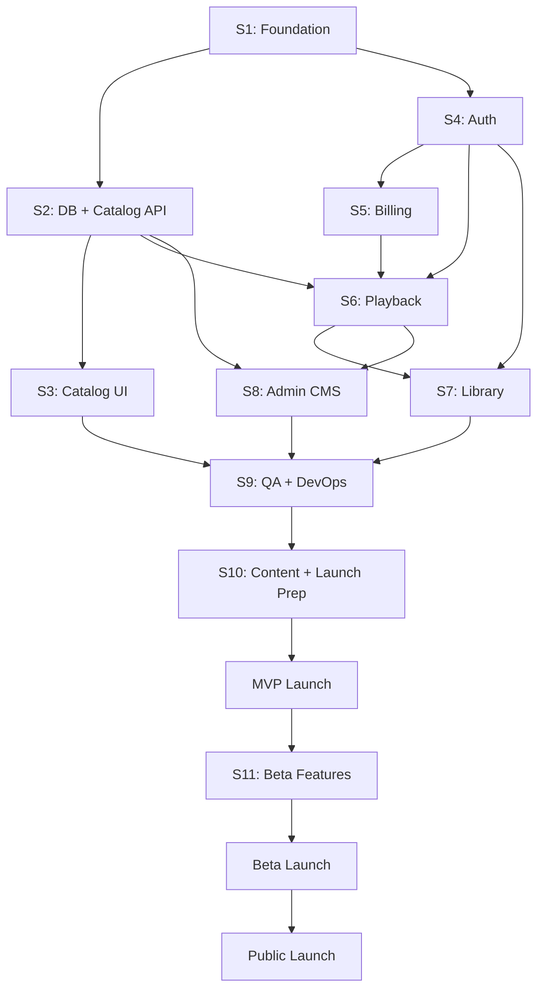

# Nexus Anime — Master Project Roadmap

**Document Type:** Consolidated Program Plan  
**Version:** 10.0 (Master)  
**Status:** Approved for Execution  
**Repository:** `webanime_WUWA`  
**Consolidates:** Phases 1–9  
**Last Updated:** June 2026

---

## Table of Contents

1. [Executive Summary](#1-executive-summary)
2. [Product Vision](#2-product-vision)
3. [Technical Architecture](#3-technical-architecture)
4. [MVP Roadmap](#4-mvp-roadmap)
5. [Production Roadmap](#5-production-roadmap)
6. [Sprint Timeline](#6-sprint-timeline)
7. [Milestones](#7-milestones)
8. [Dependencies](#8-dependencies)
9. [Team Structure](#9-team-structure)
10. [Risk Assessment](#10-risk-assessment)
11. [Launch Strategy](#11-launch-strategy)
12. [Appendix: Resolved Decisions](#12-appendix-resolved-decisions)

---

## 1. Executive Summary

**Nexus Anime** is a premium anime streaming platform designed to feel like a AAA game launcher — immersive, cinematic, and tactile. Visual language draws from the *aesthetic genre* of Wuthering Waves: deep blacks, resonance-inspired cyan glow, gold accent highlights, and holographic glass surfaces — without reproducing copyrighted game assets.

The platform targets gaming crossover and anime fans who expect console-grade UI polish. Users discover titles, subscribe, watch with adaptive streaming, and manage a personal library (watchlist, continue watching, history).

### Strategic North Star

**Weekly Active Viewers (WAV)** who complete at least one full episode and return within 7 days.

### Current State

| Item | Status |
|------|--------|
| Codebase | Next.js 16.2.9 scaffold (App Router, React 19, JavaScript) |
| Backend | Not implemented |
| Design system | Documented (Phase 2); not implemented |
| Infrastructure | Not configured |
| Content catalog | None |

### Delivery Model

| Stage | Audience | Timeline |
|-------|----------|----------|
| **Build** | Internal | Sprints 1–10 (~20 weeks) |
| **MVP Launch** | 50–100 invited users | Week 21 |
| **Beta Launch** | 500–2,000 users | Week 25 |
| **Public Launch** | Open registration | Week 33 |

### Revenue Model

| Tier | Price | MVP | Public |
|------|-------|-----|--------|
| Nexus Prime | $7.99/mo | ✅ Only tier | ✅ |
| Nexus Resonance | $12.99/mo | ❌ | Post-public |
| Nexus Free (ad-supported) | $0 | ❌ | Optional |

**Resolved:** MVP and Beta are subscription-only to reduce operational complexity. Free tier is optional at public launch.

### Key Metrics at 12 Months (Post-Public)

| Metric | Target |
|--------|--------|
| Registered users | 10,000 MAU |
| Paying subscribers | 4,000 |
| Catalog titles | 500 |
| Stream success rate | ≥ 99% |
| Uptime | ≥ 99.9% |

---

## 2. Product Vision

### 2.1 Vision Statement

> **Nexus Anime is the definitive anime discovery and streaming experience for players and fans who expect console-grade polish — a dark, cinematic portal where every screen feels like stepping into a futuristic resonance terminal.**

### 2.2 Strategic Pillars

| Pillar | Description |
|--------|-------------|
| Cinematic Immersion | Full-bleed heroes, parallax depth, launcher-style transitions |
| Resonance Aesthetic | Obsidian surfaces, cyan resonance lines, gold rarity accents |
| Frictionless Discovery | Right title in ≤ 3 interactions |
| Community at the Core | Watchlists, resonance ratings (post-MVP), curated collections |
| Platform Agnostic | Web-first; TV/mobile wrappers on roadmap |

### 2.3 Target Audience

| Persona | Age | Priority | Channel |
|---------|-----|----------|---------|
| **The Resonator** — gacha/gaming crossover fan | 18–28 | P0 | Discord, Reddit, game forums |
| **The Curator** — completionist, metadata-driven | 25–35 | P1 | AniList crossover, SEO |
| **The Casual Explorer** — viral-driven, binge-and-churn | 16–24 | P1 | TikTok, YouTube |

**Geographic focus (launch):** US, Canada, UK, Australia. Tier 2 at 6 months: Philippines, Indonesia, Brazil, Germany.

### 2.4 Competitive Position

| Competitor | Weakness | Nexus Differentiation |
|------------|----------|----------------------|
| Crunchyroll | Dated UI pockets, ad experience | AAA launcher UX, gaming-native aesthetic |
| Netflix | Weak anime metadata | Anime-native discovery, seasonal calendars |
| Aggregators | Illegal, unreliable | Legitimate licensing, premium experience |
| AniList | No native playback | Unified watch + library |

### 2.5 Core Features (Full Product)

| Domain | Features | MVP | Post-MVP |
|--------|----------|-----|----------|
| Discovery | Hero, shelves, browse, search, genre filter | ✅ | Seasonal calendar, franchise hub |
| Playback | HLS player, subtitles, autoplay, continue watching | ✅ | Skip intro, ambient mode, 4K |
| Account | Email/Google auth, settings, single profile | ✅ | Multi-profile, Discord OAuth |
| Library | Watchlist, history, progress sync | ✅ | Public collections |
| Billing | Stripe subscription (Prime) | ✅ | Resonance tier, free tier |
| Community | — | ❌ | Ratings, watch party, comments |
| Admin | CMS for titles/episodes | ✅ | Bulk ingest, analytics |

### 2.6 Complete Sitemap (Reference)

```
Public:     /  /browse  /browse/[genre]  /search  /title/[slug]  /pricing  /about  /faq  /legal/*
Auth:       /login  /register  /forgot-password  /onboarding
App:        /nexus  /nexus/watchlist  /nexus/history  /settings/*
Watch:      /title/[slug]/watch/[episode]   (auth + subscription)
Admin:      /admin  /admin/content  /admin/users  /admin/analytics
```

---

## 3. Technical Architecture

### 3.1 Architecture Overview

**Pattern:** Layered modular monolith in Next.js 16 App Router — server-first, client-enhanced.

```
┌─────────────────────────────────────────────────────────────┐
│  EDGE: Cloudflare (DNS, WAF, DDoS) + Vercel Edge             │
├─────────────────────────────────────────────────────────────┤
│  FRONTEND: Next.js 16 · React 19 · App Router                │
│    Server Components (catalog, SEO) + Client islands (player)│
├─────────────────────────────────────────────────────────────┤
│  API: Route Handlers + Server Actions                        │
├─────────────────────────────────────────────────────────────┤
│  SERVICES: Catalog · Playback · Library · Billing · Admin    │
├─────────────────────────────────────────────────────────────┤
│  DATA: PostgreSQL (Neon) · Redis (Upstash) · Drizzle ORM     │
├─────────────────────────────────────────────────────────────┤
│  MEDIA: Cloudflare R2 (images) · Cloudflare Stream (video)   │
├─────────────────────────────────────────────────────────────┤
│  EXTERNAL: Stripe · Resend · Auth.js · Sentry · Axiom        │
└─────────────────────────────────────────────────────────────┘
```

### 3.2 Technology Stack

| Layer | Technology |
|-------|------------|
| Framework | Next.js 16 (App Router) |
| Language | TypeScript (migrate from JS at Sprint 1) |
| UI | Tailwind CSS 4, Radix UI, Framer Motion |
| Fonts | Exo 2 (display), Inter (body), JetBrains Mono (mono) |
| State — server | TanStack Query |
| State — client | Zustand (player UI, preferences only) |
| Forms | React Hook Form + Zod |
| Auth | Auth.js v5 (credentials + Google OAuth) |
| Database | PostgreSQL 16 on Neon |
| ORM | Drizzle |
| Cache | Upstash Redis |
| Search | PostgreSQL FTS (MVP) → Meilisearch at 100K MAU |
| Video | Cloudflare Stream (HLS, signed URLs) |
| Images | Cloudflare R2 + CDN |
| Payments | Stripe |
| Email | Resend (Mailpit local) |
| Hosting | Vercel Pro |
| CI/CD | GitHub Actions |
| Local dev | Docker Compose (Postgres, Redis, Mailpit) |
| Testing | Vitest, Testing Library, Playwright |
| Monitoring | Sentry, Vercel Analytics, Axiom, Better Stack |

### 3.3 Frontend Architecture

| Concern | Decision |
|---------|----------|
| Rendering | SSR default; ISR for title pages (`revalidate: 300`); client islands for player |
| Route groups | `(marketing)`, `(catalog)`, `(auth)`, `(app)`, `(legal)`, `admin/` |
| `'use client'` | Lowest leaf only (player, shelves, forms, animation) |
| Data fetching | Server Components fetch directly; client uses TanStack Query |
| Path aliases | `@/components`, `@/features`, `@/lib`, `@/types` |

**Key folders:** `app/` (routes), `components/` (ui + layout + content + media), `features/` (domain modules), `lib/` (api, services, repositories, stores, auth).

### 3.4 Backend Architecture

| Layer | Responsibility |
|-------|----------------|
| Route handlers | HTTP parsing, Zod validation, auth guard, response format |
| Server Actions | Form mutations, revalidation tags |
| Services | Business logic (`CatalogService`, `PlaybackService`, etc.) |
| Repositories | Drizzle queries only; no business logic |
| Middleware | Session, auth redirect, subscription gate, rate limit |

**Standard API envelope:**

```json
{ "data": {} }
{ "error": { "message": "", "code": "", "details": [] } }
```

### 3.5 Database (Core Entities)

```
users ──┬── subscriptions
        ├── watchlist_items
        ├── watch_progress
        └── user_preferences

titles ──┬── seasons ── episodes ── stream_assets
         └── genres / tags / studios (M:N)

shelves ── shelf_items (curated rows)
```

All tables: UUID primary keys, `created_at`/`updated_at`, soft delete on user-facing content.

### 3.6 Security Architecture (Summary)

| Area | Control |
|------|---------|
| Auth | Auth.js JWT in HTTP-only Secure cookie (30-day rolling) |
| RBAC | `user`, `admin`, `superadmin`; subscriber = active Stripe sub |
| Stream access | `requireSubscriber()` before signed URL; TTL 4 hours |
| API | Zod validation, rate limits (Upstash), CSRF on mutations |
| Video | Signed HLS URLs; never in page source or SSR props |
| Secrets | Vercel encrypted env; never in client bundle |
| Edge | Cloudflare WAF, Bot Fight Mode, HSTS, CSP |

### 3.7 Design System (Summary)

| Token | Value |
|-------|-------|
| Background | Void Base `#0C0E12` |
| Primary | Resonance `#00E5CC` |
| Premium | Rift Gold `#F5A623` |
| Text | `#F0F2F5` at 100% / 70% / 45% |
| Display font | Exo 2 |
| Body font | Inter |
| Poster ratio | 2:3 |
| Hero ratio | 21:9 |
| Motion | UI ≤ 400ms; Launcher Slide on route change |

### 3.8 CDN & Caching

| Layer | Content | TTL |
|-------|---------|-----|
| Vercel Edge | HTML, `/_next/static`, ISR pages | 300s catalog / immutable static |
| Cloudflare CDN | Posters, banners (R2) | 24h |
| Redis | Shelves, titles, search, subscription status | 1–10 min |
| Stream CDN | HLS segments | Provider-managed |

### 3.9 DevOps & Deployment

| Item | Configuration |
|------|---------------|
| Branching | `main` production; feature branches; PR previews |
| CI | Lint → typecheck → unit → integration → build |
| CD | Vercel auto-deploy on merge; migrations before production |
| Environments | Local (Docker) → Preview (Neon branch) → Staging → Production |
| Rollback | Vercel promote previous deployment (< 15 min) |
| DB recovery | Neon PITR (RPO 1h, RTO 30min) |

### 3.10 Scaling Tiers (Reference)

| | 10K MAU | 100K MAU | 1M MAU |
|---|---------|----------|--------|
| Neon | Scale (1 CU) | Scale + read replica | Business + 3 replicas |
| Search | PostgreSQL FTS | Meilisearch | Meilisearch cluster |
| Redis | Upstash pay-go | Upstash Pro 1GB | Upstash Enterprise |
| Infra cost | ~$4.8K/mo | ~$47.5K/mo | ~$440K/mo |
| Dominant cost | Stream delivery (~98%) | Stream delivery | Stream delivery |

---

## 4. MVP Roadmap

### 4.1 MVP Definition

> A registered subscriber can discover a title, watch an episode with subtitles, resume later, and manage a watchlist — all within the Nexus Anime AAA launcher shell.

### 4.2 MVP Feature Checklist

| # | Feature | In MVP |
|---|---------|--------|
| 1 | Home with hero + 3 shelves | ✅ |
| 2 | Browse by genre | ✅ |
| 3 | Search (title only) | ✅ |
| 4 | Title detail + episode list | ✅ |
| 5 | Video player (HLS, subtitles, 720p/1080p) | ✅ |
| 6 | Continue watching | ✅ |
| 7 | Watchlist | ✅ |
| 8 | Email + Google auth | ✅ |
| 9 | User settings (profile, password, subscription) | ✅ |
| 10 | Admin CMS (titles, episodes, publish) | ✅ |
| 11 | Stripe subscription (Nexus Prime) | ✅ |
| 12 | Responsive web (desktop + mobile) | ✅ |

**Explicitly excluded from MVP:** Free tier, multi-profile, Discord OAuth, watch party, ratings, seasonal calendar, 4K, offline download, native apps.

### 4.3 MVP Content Requirements

| Requirement | Minimum |
|-------------|---------|
| Published titles | 50 |
| Episodes with ready streams | 200 |
| Featured hero titles | 3 |
| Active shelves | 3 |
| Subtitle languages | EN |

### 4.4 MVP Build Phases (Implementation Order)

| Phase | Deliverables |
|-------|--------------|
| **A — Foundation** | TypeScript migration, Tailwind tokens, UI primitives, root layout, providers |
| **B — Catalog** | DB schema + migrations, catalog API, browse/search/title pages, shelves |
| **C — Auth & Billing** | Auth.js, middleware, login/register, Stripe checkout + webhooks |
| **D — Playback** | Stream signing API, video player, progress sync, continue watching |
| **E — Library** | Watchlist, Nexus hub, settings pages |
| **F — Admin** | CMS for content ingest, admin guard, audit logs |
| **G — Hardening** | Tests, security review, Docker/CI, staging QA |

### 4.5 MVP Quality Gates

| Criterion | Threshold |
|-----------|-----------|
| Catalog size | ≥ 50 publishable titles |
| Player success rate | ≥ 99% manifest load (Chrome/Firefox/Safari) |
| Auth + billing E2E | 100% pass |
| LCP (Home, Title) | < 2.5s on throttled 4G |
| Open P0 bugs | 0 |
| Security scan | No critical vulnerabilities |
| Load test | LOAD-01 passed on staging |

---

## 5. Production Roadmap

### 5.1 Post-MVP Feature Roadmap

| Quarter (rel. to public launch) | Features | Infra |
|--------------------------------|----------|-------|
| **Q+0 (Beta)** | Discord OAuth, email notifications, feedback widget, referral codes, Redis caching, status page | Cloudflare Pro, Axiom |
| **Q+1** | Seasonal calendar, skip intro/outro, multi-profile, resonance ratings | Meilisearch eval |
| **Q+2** | Nexus Free tier, Nexus Resonance tier, public collections | Read replica eval |
| **Q+3** | Watch party, simulcast pipeline, concurrent stream limits | Progress write batching |
| **Q+4** | 4K (Resonance tier), DRM eval, forensic watermarking | Stream enterprise pricing |
| **Q+6** | TV layout, mobile PWA polish, localization (JA, ZH-CN) | Multi-region R2 |

### 5.2 Operational Maturity Roadmap

| Stage | Monitoring | On-Call | Testing |
|-------|------------|---------|---------|
| MVP | Sentry + Vercel Analytics | Informal | E2E on staging |
| Beta | + Axiom + Better Stack + status page | Weekly rotation | Nightly E2E |
| Public | + custom dashboards + cost alerts | Formal rotation + escalation | Lighthouse CI + monthly load test |
| 10K MAU | Full observability | PagerDuty eval | Quarterly pen test |
| 100K MAU | Meilisearch, read replica, materialized views | 24/7 on-call | Monthly load + security scan |

### 5.3 Content Roadmap

| Stage | Titles | Episodes |
|-------|--------|----------|
| MVP launch | 50–75 | 200–400 |
| Beta launch | 100–200 | 500–1,000 |
| Public launch | 100+ (target 200) | 1,000+ |
| 6 months post-public | 500 | 5,000+ |
| 12 months | 3,000 (100K tier prep) | 30,000+ |

---

## 6. Sprint Timeline

**Sprint length:** 2 weeks  
**Total build:** 10 sprints (20 weeks) before MVP launch  
**Team velocity assumption:** 1 full-stack lead + 1 frontend + 1 part-time content/ops

### Sprint Plan

| Sprint | Dates (rel.) | Focus | Exit Criteria |
|--------|--------------|-------|---------------|
| **S1** | W1–W2 | Foundation | TS migration, design tokens, Button/Badge/Input/Skeleton, PageShell, TopNav |
| **S2** | W3–W4 | Database & Catalog API | Drizzle schema migrated, titles/shelves API, seed genres |
| **S3** | W5–W6 | Catalog UI | Home, browse, search, title page, AnimeCard, HeroBanner, ContentShelf |
| **S4** | W7–W8 | Auth | Auth.js, middleware, login/register/onboarding, session guards |
| **S5** | W9–W10 | Billing | Stripe checkout, webhooks, subscription gate, pricing page |
| **S6** | W11–W12 | Playback | Stream upload pipeline, sign API, video player, progress sync |
| **S7** | W13–W14 | Library | Watchlist, continue watching, Nexus hub, settings |
| **S8** | W15–W16 | Admin CMS | Title/episode forms, publish flow, admin dashboard |
| **S9** | W17–W18 | QA & DevOps | Unit/integration/E2E tests, Docker, CI/CD, security hardening |
| **S10** | W19–W20 | Launch prep | Content ingest (50 titles), staging QA, pen test, load test |
| **—** | **W21** | **MVP Launch** | 50–100 invited users |
| **S11** | W22–W24 | Beta features | Discord OAuth, Redis cache, status page, feedback, referrals |
| **—** | **W25** | **Beta Launch** | 500–2,000 users |
| **S12–S14** | W26–W32 | Polish & scale prep | Bug fixes, performance, content to 200 titles, marketing assets |
| **—** | **W33** | **Public Launch** | Open registration |

### Sprint Ceremonies

| Ceremony | Cadence | Duration |
|----------|---------|----------|
| Sprint planning | Bi-weekly (Day 1) | 2h |
| Daily standup | Daily | 15min |
| Backlog refinement | Weekly | 1h |
| Sprint review | Bi-weekly (Day 10) | 1h |
| Retrospective | Bi-weekly (Day 10) | 45min |

---

## 7. Milestones

### 7.1 Engineering Milestones

| ID | Milestone | Target | Gate |
|----|-----------|--------|------|
| M0 | Repository scaffold | ✅ Done | Next.js 16 running |
| M1 | Design system in code | S1 end | Tokens + 5 primitives |
| M2 | Catalog browsable | S3 end | Home → title page works |
| M3 | Auth complete | S4 end | Login/register/session |
| M4 | Revenue enabled | S5 end | Stripe checkout live |
| M5 | Playback loop | S6 end | Watch + resume works |
| M6 | Feature complete | S8 end | All MVP features coded |
| M7 | Test & infra ready | S9 end | CI green, Docker local dev |
| M8 | Launch ready | S10 end | QA + security sign-off |

### 7.2 Launch Milestones

| ID | Milestone | Target | Success Metric |
|----|-----------|--------|----------------|
| L1 | MVP Launch | W21 | 50+ subscribers, stream success ≥ 95% |
| L2 | MVP Gate → Beta | W24 | Gate criteria §11.2 passed |
| L3 | Beta Launch | W25 | 300+ registered users |
| L4 | Beta Gate → Public | W32 | Gate criteria §11.3 passed |
| L5 | Public Launch | W33 | 1,500 subscribers Month 1 |
| L6 | 10K MAU | M12 post-public | Phase 8 Tier 1 triggers |

### 7.3 Scaling Milestones (Post-Launch)

| Trigger | Action |
|---------|--------|
| 1K MAU | Enable Redis shelf caching |
| 10K MAU | Neon Scale; sign URL Redis cache; ISR aggressive |
| 30K MAU | Cloudflare Pro; materialized trending view |
| 100K MAU | Meilisearch; read replica; image resize pipeline |
| 300K MAU | Progress write batching; concurrent stream limits |
| 1M MAU | Vercel Enterprise; Neon Business; multi-region R2; DRM |

---

## 8. Dependencies

### 8.1 External Service Dependencies

| Dependency | Required By | Risk | Fallback |
|------------|-------------|------|----------|
| **Content licenses** | MVP launch | High | Indie/partnership titles; aggregator API |
| **Cloudflare Stream** | Playback | Medium | Mux as alternative |
| **Stripe** | Billing | Low | Stripe handles scale |
| **Neon PostgreSQL** | All data | Low | PITR backup; Railway Postgres emergency |
| **Vercel** | Hosting | Low | Docker on Railway/Fly |
| **Google OAuth** | Auth | Low | Email-only fallback |
| **Resend** | Email | Low | Postmark alternative |

### 8.2 Internal Dependency Graph



### 8.3 Critical Path

```
Design tokens → DB schema → Catalog API → Title page → Auth → Billing → Stream signing → Player → Content ingest → QA → MVP Launch
```

**Blockers:** Content licensing and stream asset ingestion are on the critical path for MVP launch. Engineering can proceed with seed/demo content in parallel.

### 8.4 Third-Party Account Setup

| Service | Needed By | Owner |
|---------|-----------|-------|
| Vercel + GitHub integration | S1 | DevOps |
| Neon project (staging + prod) | S2 | DevOps |
| Cloudflare (DNS, R2, Stream) | S2/S6 | DevOps |
| Stripe (test + live) | S5 | Engineering |
| Google OAuth credentials | S4 | Engineering |
| Resend | S4 | Engineering |
| Upstash Redis | S11 (Beta) | DevOps |
| Sentry | S9 | DevOps |
| Domain `nexusanime.com` | S10 | Ops |

---

## 9. Team Structure

### 9.1 Launch Team (MVP → Public)

| Role | FTE | Responsibilities |
|------|-----|----------------|
| **Tech Lead / Full-Stack** | 1.0 | Architecture, backend, auth, billing, DevOps, on-call primary |
| **Frontend Engineer** | 1.0 | UI, design system, player, animation, component library |
| **Product Owner** | 0.5 | Prioritization, gate decisions, content coordination |
| **Content / Licensing** | 0.5 | Catalog sourcing, ingest, metadata quality |
| **QA** | 0.5 | Test plans, E2E, manual QA, launch checklists |
| **Design** | 0.25 | Asset review, brand consistency (Phase 2 system) |

**Total:** ~3.75 FTE at launch.

### 9.2 Post-Public Growth Team (10K+ MAU)

| Role | FTE | When |
|------|-----|------|
| Backend Engineer | +1.0 | 10K MAU |
| DevOps / SRE | +0.5 | 10K MAU |
| Community Manager | +1.0 | Public launch |
| Marketing | +0.5 | Public launch |
| Legal / Compliance | Consultant | Public launch |

### 9.3 RACI (Key Activities)

| Activity | Tech Lead | Frontend | Product | QA | Content |
|----------|-----------|----------|---------|-----|---------|
| Architecture decisions | A/R | C | C | I | I |
| UI implementation | C | A/R | C | C | I |
| API & database | A/R | C | I | C | I |
| Content ingest | C | I | C | I | A/R |
| Testing | C | C | I | A/R | I |
| Launch go/no-go | C | C | A | R | C |
| On-call | A/R | C | I | I | I |

*R = Responsible, A = Accountable, C = Consulted, I = Informed*

### 9.4 Communication Channels

| Channel | Purpose |
|---------|---------|
| `#engineering` | Daily development |
| `#incidents` | Production alerts (Beta+) |
| `#content` | Catalog and licensing |
| `#launch-war-room` | Launch week coordination |
| Discord (public) | User community and support |

---

## 10. Risk Assessment

### 10.1 Consolidated Risk Register

| ID | Risk | Likelihood | Impact | Mitigation | Owner |
|----|------|------------|--------|------------|-------|
| R1 | Content licensing delays | High | Critical | 50-title MVP minimum; partnership pipeline early | Content |
| R2 | Stream CDN costs exceed revenue | Medium | High | Bitrate caps; sign URL caching; monitor cost/title | Tech Lead |
| R3 | AAA UI scope creep | High | Medium | MVP motion budget; static shell first | Frontend |
| R4 | Trademark/aesthetic legal risk | Medium | High | Original Resonance design system; legal review | Product |
| R5 | Small team bottleneck | High | High | Vertical slices; defer P2 features; contractors for CMS | Tech Lead |
| R6 | Player cross-browser bugs | Medium | High | Video.js/Shaka; E2E on 3 browsers pre-launch | QA |
| R7 | Stripe/billing edge cases | Medium | Medium | Webhook idempotency; reconciliation admin tool | Tech Lead |
| R8 | SEO competition | High | Medium | JSON-LD; fast LCP; long-tail title pages | Frontend |
| R9 | Regional licensing restrictions | High | Medium | Geo-IP gating; per-region catalog flags | Product |
| R10 | Low-end mobile performance | Medium | High | Lazy shelves; WebP; perf budget in CI | Frontend |
| R11 | Security breach | Low | Critical | Phase 6 controls; pen test; incident playbook | Tech Lead |
| R12 | Launch day traffic spike | Low | High | Cloudflare; rate limits; Vercel auto-scale | DevOps |
| R13 | Key person dependency | Medium | High | Document architecture; bus factor mitigation | Tech Lead |
| R14 | Negative beta reception | Medium | Medium | Beta badge; feedback loop; rapid iteration | Product |

### 10.2 Risk Heat Map

```
Impact →
         Low      Medium      High       Critical
High     R8       R3,R5,R9   R2         R1
Medium   —        R6,R7,R10  R4,R13     R11
Low      —        R14        R12        —
```

### 10.3 Contingency Plans

| Scenario | Response |
|----------|----------|
| < 30 titles at MVP date | Delay MVP 2 weeks; prioritize ingest |
| Stream provider outage | Status page; communicate; retry logic |
| Payment broken at launch | Hotfix priority; extend trial for affected users |
| Security vulnerability found | Rollback or hotfix < 4h; rotate secrets |
| Team member unavailable | Scope cut to P0 only; delay non-critical features |

---

## 11. Launch Strategy

### 11.1 Three-Stage Model

```
MVP Launch (50–100 users, 2–4 weeks)
    → Gate review
Beta Launch (500–2,000 users, 4–8 weeks)
    → Gate review
Public Launch (open registration)
```

### 11.2 MVP Launch

| Item | Detail |
|------|--------|
| Access | Invite-only; unique codes or allowlisted emails |
| Billing | Nexus Prime ($7.99/mo) live |
| Content | ≥ 50 titles, 200 episodes |
| Monitoring | Sentry + Vercel Analytics + health uptime |
| Support | Discord `#support` + email |

**Gate to Beta (required):**

- [ ] Zero P0 bugs; ≤ 1 P1 with fix plan
- [ ] Stream success rate ≥ 98% (7-day avg)
- [ ] ≥ 40% invite-to-subscriber conversion
- [ ] ≥ 75 published titles with streams
- [ ] Stripe billing verified in production
- [ ] No open Critical/High security findings
- [ ] Load test LOAD-01 passed

### 11.3 Beta Launch

| Item | Detail |
|------|--------|
| Access | Waitlist waves + Discord codes + unlisted `/register` |
| Additions | Discord OAuth, Redis cache, status page, feedback widget, referrals |
| Content | ≥ 100 titles |
| On-call | Weekly rotation begins |

**Gate to Public (required):**

- [ ] Zero P0/P1 bugs
- [ ] ≥ 1,000 registered OR 500 subscribers
- [ ] Stream success ≥ 99% (14-day avg)
- [ ] Uptime ≥ 99.9% (30-day)
- [ ] Pen test remediation complete
- [ ] Incident response drill completed
- [ ] Legal pages reviewed
- [ ] Load test LOAD-01 (500 VU) + LOAD-06 spike passed

### 11.4 Public Launch

| Item | Detail |
|------|--------|
| Access | Open registration; beta badge removed |
| Marketing | Discord, Reddit, Twitter, waitlist email, SEO sitemap |
| Target Month 1 | 5,000 registered, 1,500 subscribers |
| War room | 4-hour staffed window on launch day |

### 11.5 Monitoring (Production)

| Signal | Tool | Alert |
|--------|------|-------|
| Errors | Sentry | > 50 in 5 min |
| Logs | Axiom | 5xx rate > 2% |
| Uptime | Better Stack | 2 consecutive failures |
| Web Vitals | Vercel Analytics | LCP regression |
| Stream signs | Custom | Failure rate > 2% |
| DB | Neon dashboard | CPU > 70% |
| Cost | Stream dashboard | Monthly threshold |

### 11.6 Incident Response (Summary)

| Severity | Response Time | Example |
|----------|---------------|---------|
| P0 | 15 min | Site down, all streams fail, breach |
| P1 | 1 hour | Login broken, payments fail |
| P2 | 4 hours | Search slow, single title broken |
| P3 | Next business day | Cosmetic issues |

**Workflow:** Acknowledge → Assess → Incident channel → Status page (P0/P1) → Fix or rollback → Post-incident review within 48h.

### 11.7 Rollback Strategy (Summary)

| Scenario | Action | Time |
|----------|--------|------|
| Bad deploy | Vercel promote previous | < 15 min |
| Bad migration | Forward-fix preferred; Neon PITR last resort | 30 min |
| Feature bug | Feature flag disable | < 5 min |
| Security issue | Rollback or hotfix + secret rotation | < 4 hours |

### 11.8 Master Launch Checklist (Condensed)

**Engineering:** Production env configured · migrations applied · health check green · auth + billing + stream verified · CI/smoke tests pass · rate limiting active · Sentry live

**Content:** Title/episode minimums met · heroes and shelves configured · genres seeded

**Security:** AUTH_SECRET strong · cookies Secure/HttpOnly · RBAC tested · webhooks verified · pen test done (public) · no secrets in repo

**QA:** E2E P0 journeys pass · zero P0 bugs · Lighthouse perf ≥ 80 · load test passed (beta/public)

**Legal/Ops:** Terms, Privacy, Cookie policies live · pricing accurate · support monitored · status page live (beta+) · on-call defined · rollback tested

**Go/No-Go:** Tech Lead + Product Owner sign-off per gate template

---

## 12. Appendix: Resolved Decisions

Conflicts identified across Phases 1–9 and their resolution:

| Topic | Conflict | Resolution |
|-------|----------|--------------|
| Free tier timing | Phase 1 planned free tier; MVP excluded it | Subscription-only through Beta; optional at Public |
| Language | Phase 1 scaffold JS; Phase 3+ specify TypeScript | TypeScript migration at Sprint 1 |
| Search engine | Phase 4 Postgres FTS; Phase 8 Meilisearch at 100K | FTS for MVP/Beta; Meilisearch at 100K MAU |
| Branching | Phase 5 optional `develop` branch | Single `main` until team > 3 engineers |
| Neon tier at launch | Phase 5 Launch free; Phase 9 production Scale | Neon Scale for production from MVP launch |
| Session storage | Phase 4 mentions DB sessions option | JWT stateless (Phase 6 authoritative) |
| Revenue tier at MVP | Phase 1 listed Resonance tier | Prime only at MVP; Resonance post-public |
| E2E in CI | Phase 5 optional on PR | Required for P0 features; label-triggered on PR, mandatory pre-launch |
| DRM | Phase 6 post-MVP; Phase 8 at 1M | No DRM until 1M MAU tier evaluation |
| Concurrent streams | Phase 6 post-MVP; Phase 8 at 100K | Limit introduced at 100K MAU (2 per account) |

---

## Document Index

| Phase | Topic | Key Content Merged Here |
|-------|-------|-------------------------|
| 1 | Architecture Foundation | §1, §2, §4 |
| 2 | Design System | §3.7 |
| 3 | Frontend Architecture | §3.3 |
| 4 | Backend Architecture | §3.4, §3.5 |
| 5 | DevOps & Deployment | §3.9 |
| 6 | Security Architecture | §3.6, §10, §11.6 |
| 7 | Testing & QA | §4.5, §6 S9, §11.8 |
| 8 | Scaling Strategy | §3.8, §3.10, §5.2, §7.3 |
| 9 | Production Launch Plan | §5, §6, §7, §11 |
| 10 | Master Roadmap | This document |

---

**Nexus Anime — Master Project Roadmap v10.0**  
*Single source of truth for product, engineering, and launch planning.*
