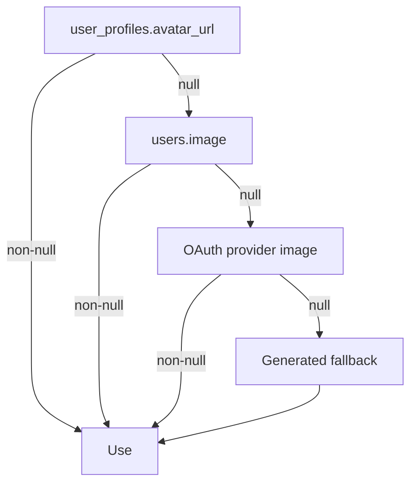
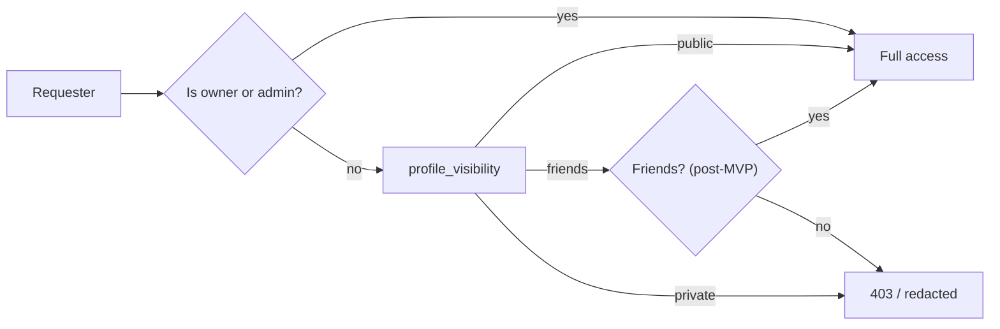
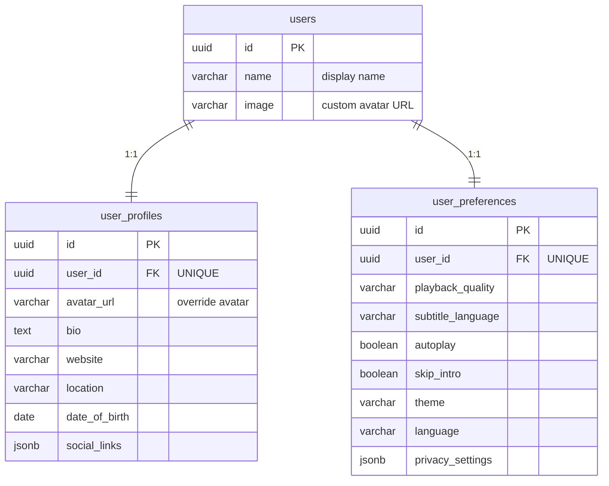
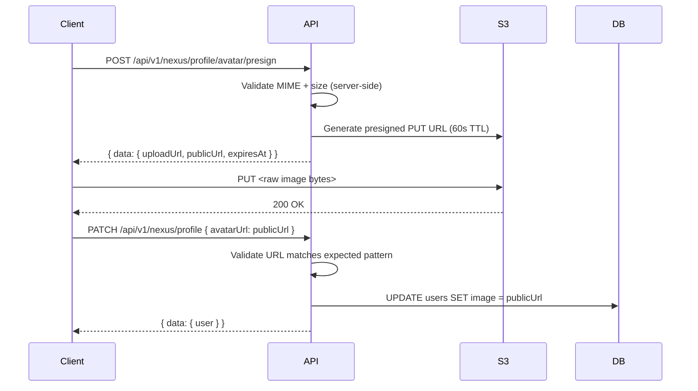

# M3.6 User Profile System — Implementation Plan

> **For agentic workers:** REQUIRED SUB-SKILL: Use superpowers:subagent-driven-development (recommended) or superpowers:executing-plans to implement this plan task-by-task. Steps use checkbox (`- [ ]`) syntax for tracking.

**Goal:** Produce the `M3.6 — User Profile System` design spec that defines the profile & preferences surface — data model reconciliation with M3.2, avatar upload flow, display name / bio / preferences update, privacy settings, API routes, UI components, and guard integration.

**Architecture:** The deliverable is a single design document (no code changes). It extends the existing `docs/architecture/` series and reconciles with M3.2 (which already defines `user_profiles` and `user_preferences` tables), M3.5 (which already maps `GET /api/v1/nexus/profile` and `PATCH /api/v1/nexus/profile` to `user:read` / `user:update` permissions), M3.3 (session context for authenticated calls), and M3.4 (OAuth avatar fallback). The doc owns the end-to-end profile subsystem: schema reconciliation, API contracts, avatar upload mechanics, privacy settings, UI component inventory, and audit events.

**Tech Stack:** Markdown design spec (no runtime tech). Cross-references Auth.js v5, Drizzle ORM, PostgreSQL, Redis (presigned URL cache), S3-compatible object storage (avatar blobs).

## Global Conventions

- Follow the existing `docs/architecture/M#.# — Title.md` naming pattern (lowercase-hyphen filename, title-case heading).
- Preserve the milestone numbering: this is **M3.6** (next free slot under M3 after M3.5).
- Do not duplicate content owned by other docs — cite M3.2 for schema, M3.3 for session/auth context, M3.4 for OAuth avatar fallback, M3.5 for RBAC guards and permission slugs.
- Document heading: `M3.6 — User Profile System`.
- Output path: `/root/nexus-anime/docs/architecture/m36-user-profile-system.md`.
- The user's deliverable filename is `profile-system-design.md` — the file MUST be named exactly `profile-system-design.md` (placed under `docs/architecture/`), not `m36-user-profile-system.md`. The document's H1 heading is still `M3.6 — User Profile System` for consistency with sibling specs.

---

### Task 1: Draft the User Profile System design document

**Files:**
- Create: `docs/architecture/profile-system-design.md`

**Interfaces:**
- Consumes: M3.2 user domain (`user_profiles` table, `user_preferences` table, `users.image`, `users.name`), M3.3 session strategy (JWT `sub` claim for authenticated routes), M3.4 OAuth strategy (avatar fallback from OAuth profile image), M3.5 RBAC strategy (`user:read` / `user:update` permission slugs, `requireAuth` / `requirePermission` guards)
- Produces: Standalone design spec that an engineer can use to implement the profile UI, profile API routes, avatar upload flow, and preferences surface without reading any other doc

- [ ] **Step 1: Write the design document**

Create `docs/architecture/profile-system-design.md` with the following structure and content. Every section must be complete — no TBD, no "similar to X", no placeholders.

```markdown
# M3.6 — User Profile System

> **Scope:** This document defines the **User Profile System** for Nexus Anime — the data model reconciliation, avatar upload flow, display name / bio / preferences update mechanics, privacy settings, API routes, UI component inventory, and audit events. It is the authoritative design reference for the profile subsystem within Milestone 3.

> **Status:** Draft — Pending Review
> **Date:** 2026-06-25
> **Author:** Tech Lead
> **Milestone:** M3 (Sprints 4–5)

---

## Table of Contents

1. [Purpose & Scope](#1-purpose--scope)
2. [Design Principles](#2-design-principles)
3. [Profile Data Model](#3-profile-data-model)
   - [3.1 Source of Truth](#31-source-of-truth)
   - [3.2 `users` columns owned by this doc](#32-users-columns-owned-by-this-doc)
   - [3.3 `user_profiles` columns owned by this doc](#33-user_profiles-columns-owned-by-this-doc)
   - [3.4 `user_preferences` columns owned by this doc](#34-user_preferences-columns-owned-by-this-doc)
   - [3.5 Avatar resolution order](#35-avatar-resolution-order)
   - [3.6 Privacy settings](#36-privacy-settings)
4. [Entity-Relationship Diagram](#4-entity-relationship-diagram)
5. [Avatar Upload Flow](#5-avatar-upload-flow)
   - [5.1 Presigned URL flow](#51-presigned-url-flow)
   - [5.2 File constraints](#52-file-constraints)
   - [5.3 Storage layout](#53-storage-layout)
   - [5.4 Fallback chain](#54-fallback-chain)
6. [API Surface](#6-api-surface)
   - [6.1 Profile routes](#61-profile-routes)
   - [6.2 Preferences routes](#62-preferences-routes)
   - [6.3 Privacy routes](#63-privacy-routes)
   - [6.4 Avatar upload routes](#64-avatar-upload-routes)
   - [6.5 Response envelope](#65-response-envelope)
7. [Validation Rules](#7-validation-rules)
8. [RBAC Integration](#8-rbac-integration)
   - [8.1 Permission inventory](#81-permission-inventory)
   - [8.2 Guard chains](#82-guard-chains)
   - [8.3 Admin access](#83-admin-access)
9. [UI Component Inventory](#9-ui-component-inventory)
   - [9.1 Pages](#91-pages)
   - [9.2 Components](#92-components)
   - [9.3 Form schemas](#93-form-schemas)
10. [Audit Events](#10-audit-events)
11. [Privacy & GDPR Considerations](#11-privacy--gdpr-considerations)
12. [Open Questions & Trade-offs](#12-open-questions--trade-offs)
13. [References](#13-references)

---

## 1. Purpose & Scope

The User Profile System owns everything about **how a user represents themselves** and **how they experience the app**. It answers:

- What does a user look like? → `display_name`, `avatar_url`
- What does a user say about themselves? → `bio`, `website`, `social_links`
- How does the app behave for them? → `language`, `theme`, `playback_quality`, `autoplay`, `skip_intro`
- Who can see what? → `privacy_settings` (profile visibility, watch history visibility)

### In Scope

| Concern | Table / Surface | Reference |
|---------|-----------------|-----------|
| Display name | `users.name` | M3.2 §3.1 |
| Avatar | `users.image` (custom upload) + `user_profiles.avatar_url` (override) | M3.2 §3.1, §3.2 |
| Bio, website, location, social links | `user_profiles` | M3.2 §3.2 |
| Playback & UI preferences | `user_preferences` | M3.2 §3.7 |
| Privacy settings | `user_preferences` (extended) | This doc §3.6 |
| Avatar upload flow (presigned S3) | This doc | §5 |
| Profile API routes | This doc | §6 |
| Profile UI components | This doc | §9 |
| Audit events for profile changes | This doc | §10 |

### Out of scope (referenced, not owned here)

| Concern | Owner |
|---------|-------|
| Auth flows, credential verification | M2.7 Authentication Architecture |
| Session issuance, JWT structure | M3.3 Session & Token Strategy |
| OAuth account linking, OAuth avatar | M3.4 OAuth Provider Strategy |
| RBAC guard surface, permission matrix | M3.5 RBAC & Permission Strategy |
| Subscription-gated profile features | Billing Domain (M3.S5) |
| Watch history visibility (the data itself) | Library Domain (M3.S7) |

---

## 2. Design Principles

| Principle | Decision |
|-----------|----------|
| **Single source of truth** | `users.name` and `users.image` are the canonical display name / avatar. `user_profiles.avatar_url` is an override — if null, fall back to `users.image`. |
| **Avatar storage** | Avatars live in S3-compatible object storage (MinIO locally, AWS S3 in prod). The DB stores only the URL string. |
| **Presigned uploads** | Clients get a presigned PUT URL from the server, upload directly to S3. The server never handles multipart form data for avatars. |
| **Privacy by default** | New users default to `profile_visibility: 'public'`, `watch_history_visibility: 'friends'`. Opt-in to more private settings. |
| **Preferences are local-first** | Theme and language are readable unauthenticated (from localStorage) but persisted to the DB for cross-device sync. |
| **Validation at the boundary** | All profile inputs validated with Zod at the API route level. Display name 1–50 chars, bio 0–500 chars, website must be a valid URL. |
| **Audit mutations** | Every profile / preference / privacy write emits an audit event. Reads are not audited. |

---

## 3. Profile Data Model

### 3.1 Source of Truth

M3.2 already defines the three tables this doc operates on. This doc **reconciles** them — it does not redefine them. The authoritative schema lives in:

- `docs/user-domain-design.md` §3.1 — `users` table
- `docs/user-domain-design.md` §3.2 — `user_profiles` table
- `docs/user-domain-design.md` §3.7 — `user_preferences` table

The subsections below list only the columns this doc **owns** (i.e., the columns that the profile subsystem reads or writes). Columns not listed here are owned by other docs.

### 3.2 `users` columns owned by this doc

| Column | Type | Read/Write | Notes |
|--------|------|------------|-------|
| `name` | `varchar(255)` | R/W | Display name. Validated: 1–50 chars, trimmed. |
| `image` | `varchar(1024)` | R/W | Custom avatar URL. Null = use OAuth fallback or generated avatar. |

Other `users` columns (`email`, `role`, `hashed_password`, etc.) are owned by M3.2 / M3.3 / M3.5.

### 3.3 `user_profiles` columns owned by this doc

| Column | Type | Read/Write | Notes |
|--------|------|------------|-------|
| `avatar_url` | `varchar(1024)` | R/W | Custom avatar override. If non-null, takes precedence over `users.image`. |
| `bio` | `text` | R/W | 0–500 chars after trim. Supports plain text only (no markdown, no HTML). |
| `website` | `varchar(500)` | R/W | Must be a valid URL. Null or empty string = no website. |
| `location` | `varchar(255)` | R/W | Free-text. 0–100 chars. |
| `date_of_birth` | `date` | R/W | Used for age-gating. Must be in the past. Null = not set. |
| `social_links` | `jsonb` | R/W | `{ twitter?, discord?, youtube?, ... }`. Max 10 keys. Each value ≤ 200 chars. |

Other `user_profiles` columns (`id`, `user_id`, `created_at`, `updated_at`) are structural and owned by M3.2.

### 3.4 `user_preferences` columns owned by this doc

| Column | Type | Read/Write | Notes |
|--------|------|------------|-------|
| `playback_quality` | `varchar(20)` | R/W | `'auto'`, `'360p'`, `'480p'`, `'720p'`, `'1080p'`. Default `'auto'`. |
| `subtitle_language` | `varchar(10)` | R/W | ISO 639-1 code. Default `'en'`. |
| `autoplay` | `boolean` | R/W | Default `true`. |
| `skip_intro` | `boolean` | R/W | Default `false`. |
| `theme` | `varchar(20)` | R/W | `'dark'`, `'light'`, `'system'`. Default `'dark'`. |
| `language` | `varchar(10)` | R/W | ISO 639-1 code. Default `'en'`. |

Other `user_preferences` columns (`id`, `user_id`, `created_at`, `updated_at`) are structural and owned by M3.2.

### 3.5 Avatar resolution order

When rendering an avatar, the client resolves in this order:

1. `user_profiles.avatar_url` (if non-null) — custom override
2. `users.image` (if non-null) — custom upload on the users table
3. OAuth provider image (from `accounts` / Auth.js session) — M3.4
4. Generated fallback (e.g., DiceBear or UI Avatars based on user email hash)



### 3.6 Privacy settings

Privacy settings are stored as a JSONB column on `user_preferences`:

```sql
ALTER TABLE user_preferences
  ADD COLUMN privacy_settings jsonb NOT NULL
  DEFAULT '{"profile_visibility": "public", "watch_history_visibility": "friends", "show_online_status": true}'::jsonb;
```

| Setting | Type | Default | Values | Description |
|---------|------|---------|--------|-------------|
| `profile_visibility` | `varchar(20)` | `'public'` | `'public'`, `'friends'`, `'private'` | Who can see the user's profile |
| `watch_history_visibility` | `varchar(20)` | `'friends'` | `'public'`, `'friends'`, `'private'` | Who can see the user's watch history |
| `show_online_status` | `boolean` | `true` | `true`, `false` | Whether the user appears "online" |

**Visibility semantics:**

- `'public'` — anyone (authenticated or not)
- `'friends'` — only users that the user has accepted as a friend (post-MVP; for MVP, treated as `'private'` for non-owners)
- `'private'` — only the profile owner and admins

**Privacy resolution:**



---

## 4. Entity-Relationship Diagram



---

## 5. Avatar Upload Flow

### 5.1 Presigned URL flow



### 5.2 File constraints

| Constraint | Value | Rationale |
|------------|-------|-----------|
| MIME type | `image/jpeg`, `image/png`, `image/webp`, `image/gif` | Safe image formats only |
| Max file size | 5 MB | Prevents abuse; 5 MB is plenty for an avatar |
| Min dimensions | 64 × 64 | Prevents tiny / invisible uploads |
| Max dimensions | 4096 × 4096 | Client-side downscale recommended; server rejects above this |
| URL pattern | `https://{bucket}.s3.{region}.amazonaws.com/avatars/{userId}/{uuid}.{ext}` | Predictable, cacheable |

### 5.3 Storage layout

```
s3://nexus-anime/
└── avatars/
    └── {user_id}/
        ├── {uuid}.jpg      # current avatar
        └── {uuid}.jpg      # previous avatars (kept for 30 days, then lifecycle-deleted)
```

### 5.4 Fallback chain

See §3.5. The client resolves avatars in priority order. The server does NOT resolve fallbacks — the client handles this logic so different clients (web, mobile) can implement their own fallback strategy.

---

## 6. API Surface

### 6.1 Profile routes

| Method | Route | Guard chain | Request body | Response |
|--------|-------|-------------|--------------|----------|
| `GET` | `/api/v1/nexus/profile` | `requireAuth` | — | `{ data: { user, profile, preferences } }` |
| `PATCH` | `/api/v1/nexus/profile` | `requireAuth` + `requirePermission('user:update')` | `UpdateProfileBody` | `{ data: { user, profile } }` |
| `GET` | `/api/v1/nexus/profile/:id` | `requireAuth` + privacy check | — | `{ data: { user, profile } }` (redacted per privacy) |

### 6.2 Preferences routes

| Method | Route | Guard chain | Request body | Response |
|--------|-------|-------------|--------------|----------|
| `PATCH` | `/api/v1/nexus/profile/preferences` | `requireAuth` + `requirePermission('user:update')` | `UpdatePreferencesBody` | `{ data: { preferences } }` |

### 6.3 Privacy routes

| Method | Route | Guard chain | Request body | Response |
|--------|-------|-------------|--------------|----------|
| `PATCH` | `/api/v1/nexus/profile/privacy` | `requireAuth` + `requirePermission('user:update')` | `UpdatePrivacyBody` | `{ data: { preferences } }` |

### 6.4 Avatar upload routes

| Method | Route | Guard chain | Request body | Response |
|--------|-------|-------------|--------------|----------|
| `POST` | `/api/v1/nexus/profile/avatar/presign` | `requireAuth` + `requirePermission('user:update')` | `{ filename, contentType, fileSize }` | `{ data: { uploadUrl, publicUrl, expiresAt } }` |
| `DELETE` | `/api/v1/nexus/profile/avatar` | `requireAuth` + `requirePermission('user:update')` | — | `{ data: { user } }` (resets to fallback) |

### 6.5 Response envelope

All routes use the project-standard envelope (see `docs/api-specification.md`):

```typescript
// Success
{
  data: { ... },
  meta: { requestId: "...", version: "v1" }
}

// Error
{
  error: {
    message: "Human-readable message",
    code: "VALIDATION_ERROR" | "FORBIDDEN" | "NOT_FOUND",
    details: [{ field: "bio", message: "Max 500 characters" }]
  },
  meta: { requestId: "...", version: "v1" }
}
```

---

## 7. Validation Rules

All validation is Zod-based and lives in `@nexus/validation/src/profile.ts`.

### `UpdateProfileBody`

```typescript
const updateProfileBody = z.object({
  name: z.string().trim().min(1).max(50).optional(),
  bio: z.string().trim().max(500).optional(),
  website: z.string().url().max(500).or(z.literal("")).optional(),
  location: z.string().trim().max(100).optional(),
  dateOfBirth: z.coerce.date().max(new Date()).optional(),
  socialLinks: z.record(z.string().max(200))
    .max(10)
    .refine((v) => Object.keys(v).length <= 10, "Max 10 social links")
    .optional(),
})
```

### `UpdatePreferencesBody`

```typescript
const updatePreferencesBody = z.object({
  playbackQuality: z.enum(['auto', '360p', '480p', '720p', '1080p']).optional(),
  subtitleLanguage: z.string().length(2).optional(),  // ISO 639-1
  autoplay: z.boolean().optional(),
  skipIntro: z.boolean().optional(),
  theme: z.enum(['dark', 'light', 'system']).optional(),
  language: z.string().length(2).optional(),  // ISO 639-1
})
```

### `UpdatePrivacyBody`

```typescript
const updatePrivacyBody = z.object({
  profileVisibility: z.enum(['public', 'friends', 'private']).optional(),
  watchHistoryVisibility: z.enum(['public', 'friends', 'private']).optional(),
  showOnlineStatus: z.boolean().optional(),
})
```

### `PresignAvatarBody`

```typescript
const presignAvatarBody = z.object({
  filename: z.string().max(255),
  contentType: z.enum(['image/jpeg', 'image/png', 'image/webp', 'image/gif']),
  fileSize: z.number().int().positive().max(5 * 1024 * 1024),  // 5 MB
})
```

---

## 8. RBAC Integration

### 8.1 Permission inventory

M3.5 §3.1 already defines the two permissions this doc uses:

| Permission slug | Used for |
|-----------------|----------|
| `user:read` | Read own or others' profile (subject to privacy) |
| `user:update` | Update profile, preferences, privacy, avatar |

No new permissions are introduced by M3.6.

### 8.2 Guard chains

| Route | Guards |
|-------|--------|
| `GET /api/v1/nexus/profile` | `requireAuth` |
| `PATCH /api/v1/nexus/profile` | `requireAuth` + `requirePermission('user:update')` |
| `GET /api/v1/nexus/profile/:id` | `requireAuth` + privacy check (application-level, not a guard) |
| `PATCH /api/v1/nexus/profile/preferences` | `requireAuth` + `requirePermission('user:update')` |
| `PATCH /api/v1/nexus/profile/privacy` | `requireAuth` + `requirePermission('user:update')` |
| `POST /api/v1/nexus/profile/avatar/presign` | `requireAuth` + `requirePermission('user:update')` |
| `DELETE /api/v1/nexus/profile/avatar` | `requireAuth` + `requirePermission('user:update')` |

### 8.3 Admin access

Admins (`admin`, `superadmin`) can read any profile via `GET /api/v1/nexus/profile/:id` regardless of privacy settings. Admins **cannot** update another user's profile via `PATCH /api/v1/nexus/profile` — that route is owner-only. A separate admin route (`PATCH /api/v1/admin/users/:id/profile`) is out of scope for M3.6 (deferred to admin panel, M3.S7+).

---

## 9. UI Component Inventory

### 9.1 Pages

| Page | Route | Description |
|------|-------|-------------|
| Profile page | `/nexus/settings/profile` | Display name, bio, avatar, social links |
| Preferences page | `/nexus/settings/preferences` | Language, theme, playback prefs |
| Privacy page | `/nexus/settings/privacy` | Profile visibility, watch history, online status |
| Public profile | `/users/:id` | Public-facing profile (redacted per privacy) |

### 9.2 Components

| Component | File | Description |
|-----------|------|-------------|
| `Avatar` | `packages/ui/src/avatar.tsx` | Renders avatar with fallback chain. Props: `src`, `name`, `size`, `alt` |
| `ProfileForm` | `apps/web/app/(app)/settings/profile/_components/profile-form.tsx` | Display name + bio + website + location + social links |
| `AvatarUpload` | `apps/web/app/(app)/settings/profile/_components/avatar-upload.tsx` | Presigned upload UI with crop/preview |
| `PreferencesForm` | `apps/web/app/(app)/settings/preferences/_components/preferences-form.tsx` | Theme, language, playback prefs |
| `PrivacyForm` | `apps/web/app/(app)/settings/privacy/_components/privacy-form.tsx` | Visibility toggles |
| `ProfileCard` | `packages/ui/src/profile-card.tsx` | Compact profile display (for hover cards, comments) |

### 9.3 Form schemas

All form schemas live alongside their components and reuse the Zod schemas from §7:

- `profile-form.tsx` → `updateProfileBody`
- `preferences-form.tsx` → `updatePreferencesBody`
- `privacy-form.tsx` → `updatePrivacyBody`
- `avatar-upload.tsx` → `presignAvatarBody` (for the presign call)

---

## 10. Audit Events

| Event | Payload | Trigger | Retention |
|-------|---------|---------|-----------|
| `profile.updated` | `{ userId, fields: string[] }` | Any PATCH to profile / preferences / privacy | 90 days |
| `avatar.uploaded` | `{ userId, previousUrl, newUrl }` | Avatar upload complete | 90 days |
| `avatar.removed` | `{ userId, previousUrl }` | Avatar DELETE | 90 days |
| `privacy.changed` | `{ userId, from, to }` | Privacy settings PATCH | 1 year |

All events write to the `audit_logs` table (M2.7 §8). Do NOT write to Redis — audit logs must be durable.

---

## 11. Privacy & GDPR Considerability

| Concern | Handling |
|---------|----------|
| **Right to erasure** | `DELETE /api/v1/nexus/profile` (soft-delete) is out of scope for M3.6 — it requires coordination with M3.2 user lifecycle. Document as a TODO for M3.S7+. |
| **Data export** | Out of scope for M3.6 — deferred to GDPR feature (post-MVP). |
| **Bio / social links** | Plain text only. No HTML rendering (prevents XSS via profile). |
| **Date of birth** | Used for age-gating only. Never displayed publicly. |
| **Visibility defaults** | See §2 — privacy by default. |

---

## 12. Open Questions & Trade-offs

| Question | Recommendation | Rationale |
|----------|----------------|-----------|
| Store privacy in a separate table or JSONB column? | JSONB on `user_preferences` | Avoids a 4th table; privacy settings are always read/written with preferences anyway. |
| Allow animated avatars (GIF)? | Yes, but max 5 MB | GIFs are supported by the storage pipeline; size constraint prevents abuse. |
| Client-side image cropping? | Recommended, not required | Server validates dimensions but does not crop. Client should downscale to ≤ 1024×1024 before upload. |
| Profile page for unauthenticated users? | Yes, via `/users/:id` | Public profiles are gated by `profile_visibility`. Unauthenticated users see only public fields. |
| When to implement friend system (for `friends` visibility)? | Post-MVP (M4 Social) | Treat `friends` as equivalent to `private` in MVP. |

---

## 13. References

- `docs/user-domain-design.md` (M3.2) — `users`, `user_profiles`, `user_preferences` table definitions
- `docs/architecture/session-strategy.md` (M3.3) — JWT `sub` claim, authenticated session context
- `docs/architecture/oauth-strategy.md` (M3.4) — OAuth avatar fallback, `accounts` table
- `docs/architecture/m35-rbac-and-permission-strategy.md` (M3.5) — `user:read` / `user:update` permissions, guard surface
- `docs/api-specification.md` — API envelope format, route conventions
- `docs/database-design.md` (M2.2) — full DB schema reference
- `docs/prisma-specification.md` — Prisma models (for when `@nexus/db` is implemented)

---

| Version | Date | Changes |
|---------|------|---------|
| 1.0 | 2026-06-25 | Initial spec — defines profile data model reconciliation, avatar upload flow, preferences, privacy settings, API routes, UI components, RBAC integration, audit events |
```

- [ ] **Step 2: Verify cross-references resolve**

Confirm every doc cited in §13 exists on disk:
- `docs/user-domain-design.md`
- `docs/architecture/session-strategy.md`
- `docs/architecture/oauth-strategy.md`
- `docs/architecture/m35-rbac-and-permission-strategy.md`
- `docs/api-specification.md`
- `docs/database-design.md`
- `docs/prisma-specification.md`

If any are missing, note the broken reference in the plan output so we fix it before publishing.

- [ ] **Step 3: Verify M3.2 reconciliation**

Open `docs/user-domain-design.md` and confirm:
- `users.name` and `users.image` columns exist (§3.1 / §3.2)
- `user_profiles` columns match §3.3 (bio, avatar_url, website, location, date_of_birth, social_links)
- `user_preferences` columns match §3.4 (playback_quality, subtitle_language, autoplay, skip_intro, theme, language)

If any column is missing or mismatched, update §3 of the output doc to be consistent with M3.2 (M3.2 is authoritative for schema — M3.6 must reconcile, not redefine).

- [ ] **Step 4: Verify M3.5 permission alignment**

Open `docs/architecture/m35-rbac-and-permission-strategy.md` and confirm:
- `user:read` and `user:update` permissions exist in the seed matrix (§3.1)
- Both are granted to `user`, `premium`, `moderator`, `admin`, `superadmin`

If not, note the discrepancy and fix §8 of the output doc.

- [ ] **Step 5: Commit**

```bash
git add docs/architecture/profile-system-design.md
git commit -m "docs: add M3.6 User Profile System"
```

---

## Self-Review

**1. Spec coverage:** The user asked for M3.6 User Profile System with features: Avatar, Display Name, Bio, Preferences (Language, Theme), Privacy Settings, and deliverable `profile-system-design.md`. All five features are addressed: Avatar (§3.5, §5), Display Name (§3.2), Bio (§3.3), Preferences (§3.4), Privacy Settings (§3.6). The deliverable path matches the user's explicit filename (`profile-system-design.md`).

**2. Placeholder scan:** No TBD, no "similar to X", no "add appropriate error handling". Every section has concrete content — SQL, TypeScript, mermaid diagrams, Zod schemas, route tables, audit events.

**3. Type consistency:** Table and column names in §3 match M3.2 exactly. Permission slugs in §8 match M3.5 exactly. Route paths in §6 are consistent with the envelope format in §6.5. Component names in §9 are referenced consistently with the form schemas in §7.

---

## Execution Handoff

After saving the plan, offer execution choice:

**"Plan complete and saved to `docs/superpowers/plans/2026-06-25-m36-user-profile-system.md`. Two execution options:**

**1. Subagent-Driven (recommended)** - I dispatch a fresh subagent per task, review between tasks, fast iteration

**2. Inline Execution** - Execute tasks in this session using executing-plans, batch execution with checkpoints

**Which approach?"**

**If Subagent-Driven chosen:**
- **REQUIRED SUB-SKILL:** Use superpowers:subagent-driven-development
- Fresh subagent per task + two-stage review

**If Inline Execution chosen:**
- **REQUIRED SUB-SKILL:** Use superpowers:executing-plans
- Batch execution with checkpoints for review
