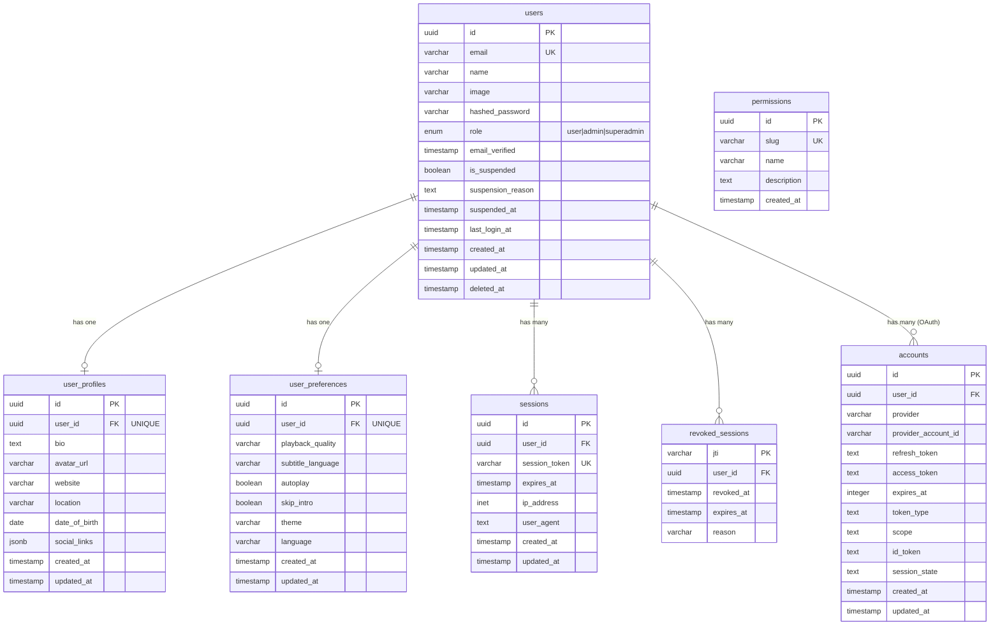
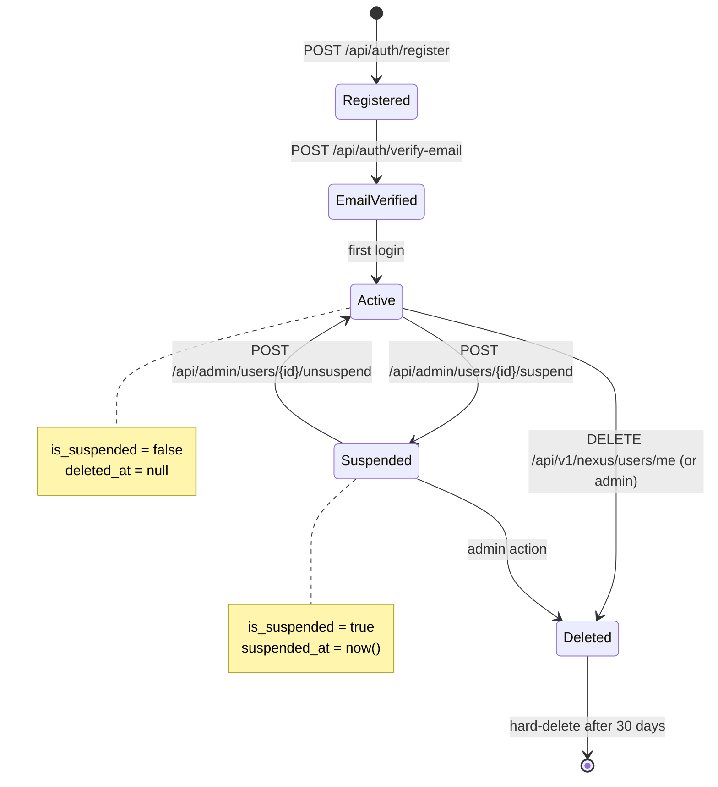
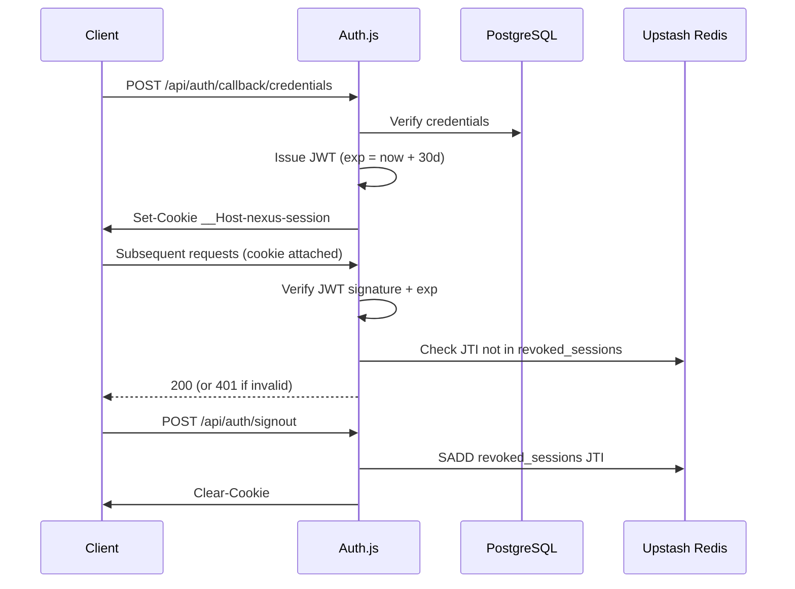
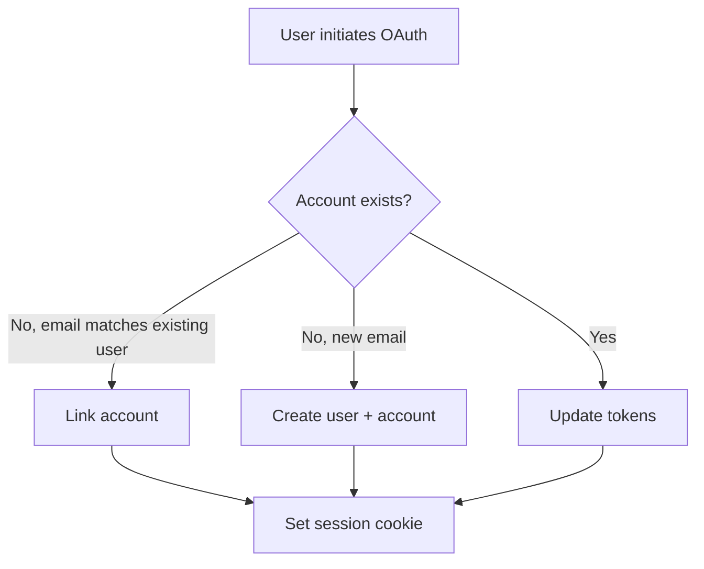

# M3.2 — User Domain Design

> **Scope:** This document defines the **User Domain** for Nexus Anime — the entities, relationships, constraints, lifecycle, and API surface covering user identity, profiles, roles, permissions, sessions, OAuth accounts, and settings. It is the authoritative design reference for Milestone 3 (Sprints 4–5: Auth + Billing).

> **Status:** Draft — Pending Review
> **Date:** 2026-06-25
> **Author:** Tech Lead
> **Milestone:** M3 (Sprints 4–5)

---

## Table of Contents

1. [Purpose & Scope](#1-purpose--scope)
2. [Design Principles](#2-design-principles)
3. [Entities](#3-entities)
   - [3.1 User](#31-user)
   - [3.2 UserProfile](#32-userprofile)
   - [3.3 Role](#33-role)
   - [3.4 Permission](#34-permission)
   - [3.5 Session](#35-session)
   - [3.6 OAuthAccount](#36-oauthaccount)
   - [3.7 UserSettings](#37-usersettings)
4. [Entity-Relationship Diagram](#4-entity-relationship-diagram)
5. [Relationships Matrix](#5-relationships-matrix)
6. [Constraints](#6-constraints)
7. [Lifecycle](#7-lifecycle)
   - [7.1 User Lifecycle](#71-user-lifecycle)
   - [7.2 Session Lifecycle](#72-session-lifecycle)
   - [7.3 OAuthAccount Lifecycle](#73-oauthaccount-lifecycle)
   - [7.4 Permission & Role Lifecycle](#74-permission--role-lifecycle)
8. [API Surface](#8-api-surface)
9. [Security & Privacy](#9-security--privacy)
10. [Schema Gaps & Migration Notes](#10-schema-gaps--migration-notes)
11. [References](#11-references)

---

## 1. Purpose & Scope

The User Domain owns everything about **who a user is** and **what they are allowed to do** in Nexus Anime. It answers:

- How is a user identified? → `User` + `UserProfile`
- What can they do? → `Role` + `Permission`
- How do they prove who they are? → `Session` + `OAuthAccount`
- How do they experience the app? → `UserSettings`

### In Scope

| Entity | Table | Sprint |
|--------|-------|--------|
| `User` | `users` | S4 |
| `UserProfile` | `user_profiles` | S4 |
| `Role` | `users.role` (enum column) | S4 |
| `Permission` | `permissions` (reference table) | S4 |
| `Session` | `sessions` (Auth.js-managed) | S4 |
| `OAuthAccount` | `accounts` (Auth.js-managed) | S4 |
| `UserSettings` | `user_preferences` | S4 |

### Out of Scope (referenced, not owned here)

- **Subscription / billing** → owned by Billing Domain (M3.S5, `subscriptions` table)
- **Watch history / watchlists** → owned by Library Domain (M3.S7)
- **Notifications** → owned by Notification Domain (M3.S7+)

---

## 2. Design Principles

| Principle | Decision |
|-----------|----------|
| **Primary keys** | UUID v4 (`gen_random_uuid()`) — safe for distributed systems, no sequential enumeration |
| **Timestamps** | `created_at` and `updated_at` with `DEFAULT now()` on every table; `updated_at` updated via trigger |
| **Soft delete** | `deleted_at` timestamp (nullable) on `users`; hard-delete cascades for `user_profiles`, `user_preferences` |
| **Naming** | Snake_case columns; singular table names; junction tables as `entity1_entity2` |
| **Text search** | PostgreSQL `tsvector` with GIN index on `users.name` for admin user search |
| **Enum handling** | PostgreSQL `ENUM` types for stable, constrained value sets (`user_role`, `session_status`) |
| **Auth authority** | Auth.js v5 is the source of truth for credential verification, session issuance, and OAuth flows. This document describes the *data model* it operates on. |

---

## 3. Entities

### 3.1 User

The **core identity record**. Authentication is delegated to Auth.js v5; this table stores the canonical user row.

| Column | Type | Constraints | Description |
|--------|------|-------------|-------------|
| `id` | `uuid` | `PRIMARY KEY DEFAULT gen_random_uuid()` | Unique identifier |
| `email` | `varchar(255)` | `UNIQUE NOT NULL` | Login credential; case-insensitive in app logic |
| `name` | `varchar(255)` | `NOT NULL DEFAULT ''` | Display name (1–50 chars enforced by Zod) |
| `image` | `varchar(1024)` | | Avatar URL (falls back to OAuth profile image) |
| `hashed_password` | `varchar(255)` | | Bcrypt hash; `null` for OAuth-only users |
| `role` | `user_role` | `NOT NULL DEFAULT 'user'` | RBAC: `user`, `admin`, `superadmin` |
| `email_verified` | `timestamptz` | | Set when email verification completes |
| `is_suspended` | `boolean` | `NOT NULL DEFAULT false` | Suspension flag (admin action) |
| `suspension_reason` | `text` | | Reason for suspension (audit) |
| `suspended_at` | `timestamptz` | | When suspended |
| `last_login_at` | `timestamptz` | | Last successful login |
| `created_at` | `timestamptz` | `NOT NULL DEFAULT now()` | Record creation |
| `updated_at` | `timestamptz` | `NOT NULL DEFAULT now()` | Last modification |
| `deleted_at` | `timestamptz` | | Soft delete marker |

```sql
CREATE TYPE user_role AS ENUM ('user', 'admin', 'superadmin');

CREATE TABLE users (
    id uuid PRIMARY KEY DEFAULT gen_random_uuid(),
    email varchar(255) UNIQUE NOT NULL,
    name varchar(255) NOT NULL DEFAULT '',
    image varchar(1024),
    hashed_password varchar(255),
    role user_role NOT NULL DEFAULT 'user',
    email_verified timestamptz,
    is_suspended boolean NOT NULL DEFAULT false,
    suspension_reason text,
    suspended_at timestamptz,
    last_login_at timestamptz,
    created_at timestamptz NOT NULL DEFAULT now(),
    updated_at timestamptz NOT NULL DEFAULT now(),
    deleted_at timestamptz
);
```

**Indexes:**

```sql
CREATE INDEX idx_users_email ON users(lower(email));       -- case-insensitive lookups
CREATE INDEX idx_users_role ON users(role);
CREATE INDEX idx_users_created_at ON users(created_at DESC);
CREATE INDEX idx_users_last_login ON users(last_login_at DESC);
CREATE INDEX idx_users_deleted_at ON users(deleted_at) WHERE deleted_at IS NULL;
```

### 3.2 UserProfile

Extended profile data separated from `users` to keep the auth table lean. One-to-one with `users`.

| Column | Type | Constraints | Description |
|--------|------|-------------|-------------|
| `id` | `uuid` | `PRIMARY KEY DEFAULT gen_random_uuid()` | Unique identifier |
| `user_id` | `uuid` | `UNIQUE NOT NULL REFERENCES users(id) ON DELETE CASCADE` | Owner |
| `bio` | `text` | | Short biography (max 500 chars by Zod) |
| `avatar_url` | `varchar(1024)` | | Custom avatar (overrides `users.image`) |
| `website` | `varchar(500)` | | Personal website URL |
| `location` | `varchar(255)` | | Free-text location |
| `date_of_birth` | `date` | | Birth date (age-gating) |
| `social_links` | `jsonb` | | `{twitter, discord, ...}` (max 10 keys by Zod) |
| `created_at` | `timestamptz` | `NOT NULL DEFAULT now()` | Record creation |
| `updated_at` | `timestamptz` | `NOT NULL DEFAULT now()` | Last modification |

```sql
CREATE TABLE user_profiles (
    id uuid PRIMARY KEY DEFAULT gen_random_uuid(),
    user_id uuid UNIQUE NOT NULL REFERENCES users(id) ON DELETE CASCADE,
    bio text,
    avatar_url varchar(1024),
    website varchar(500),
    location varchar(255),
    date_of_birth date,
    social_links jsonb,
    created_at timestamptz NOT NULL DEFAULT now(),
    updated_at timestamptz NOT NULL DEFAULT now()
);
```

### 3.3 Role

Roles are **not a separate table** in MVP. They are an enum column on `users.role`. The role hierarchy is flat:

```
superadmin → admin → user → anonymous
```

| Role | Capabilities |
|------|-------------|
| `anonymous` | Public catalog browse, login, register |
| `user` | Anonymous + manage own profile, library, watchlist, favorites, reviews |
| `admin` | User + CMS (titles, episodes, shelves), view analytics, manage users |
| `superadmin` | Admin + role assignment, user suspension, system configuration |

**Why no `roles` table?** The master roadmap specifies MVP RBAC with a fixed hierarchy. A `roles` table adds admin-UI complexity (role CRUD) that is not needed until post-MVP ABAC (see M2.7 §10.5). The `Permission` entity (§3.4) provides an audit trail of *what* each role can do without requiring runtime permission checks.

### 3.4 Permission

A **reference table** describing every actionable capability in the system, mapped to the roles that hold it. Used for:

1. **Audit / documentation** — a single place to see who can do what
2. **Admin UI read-only display** — show role capabilities in admin panel
3. **Future migration** — when ABAC is introduced (post-MVP), this table becomes the permission grant ledger

| Column | Type | Constraints | Description |
|--------|------|-------------|-------------|
| `id` | `uuid` | `PRIMARY KEY DEFAULT gen_random_uuid()` | Unique identifier |
| `slug` | `varchar(100)` | `UNIQUE NOT NULL` | Machine-readable key, e.g. `title:create` |
| `name` | `varchar(255)` | `NOT NULL` | Human-readable name |
| `description` | `text` | | What this permission allows |
| `created_at` | `timestamptz` | `NOT NULL DEFAULT now()` | Record creation |

```sql
CREATE TABLE permissions (
    id uuid PRIMARY KEY DEFAULT gen_random_uuid(),
    slug varchar(100) UNIQUE NOT NULL,
    name varchar(255) NOT NULL,
    description text,
    created_at timestamptz NOT NULL DEFAULT now()
);
```

**Seed data (MVP):**

| slug | name | Roles |
|------|------|-------|
| `title:create` | Create titles | `admin`, `superadmin` |
| `title:update` | Update titles | `admin`, `superadmin` |
| `title:delete` | Delete titles | `admin`, `superadmin` |
| `episode:create` | Create episodes | `admin`, `superadmin` |
| `episode:update` | Update episodes | `admin`, `superadmin` |
| `episode:delete` | Delete episodes | `admin`, `superadmin` |
| `user:read` | Read own profile | `user`, `admin`, `superadmin` |
| `user:update` | Update own profile | `user`, `admin`, `superadmin` |
| `user:manage` | Manage any user | `admin`, `superadmin` |
| `user:suspend` | Suspend users | `superadmin` |
| `role:assign` | Assign roles | `superadmin` |
| `analytics:read` | View analytics | `admin`, `superadmin` |
| `shelf:manage` | Manage curated shelves | `admin`, `superadmin` |
| `comment:delete_any` | Delete any comment | `admin`, `superadmin` |
| `review:delete_any` | Delete any review | `admin`, `superadmin` |

> **Note:** There is no `role_permissions` junction table in MVP. The mapping above is enforced in application code (in `@nexus/auth/guards.ts`), not in the database. This is intentional — see §6.

### 3.5 Session

Sessions are managed by **Auth.js v5** as JWTs in HTTP-only cookies. The `sessions` table below is the **logical schema** — Auth.js with the Drizzle adapter may not materialize it identically (Auth.js defaults to JWT-in-cookie without a `sessions` table). The `revoked_sessions` table is our addition for explicit revocation.

| Column | Type | Constraints | Description |
|--------|------|-------------|-------------|
| `id` | `uuid` | `PRIMARY KEY DEFAULT gen_random_uuid()` | Session ID |
| `user_id` | `uuid` | `NOT NULL REFERENCES users(id) ON DELETE CASCADE` | Owner |
| `session_token` | `varchar(255)` | `UNIQUE NOT NULL` | Opaque token (if DB-backed) |
| `expires_at` | `timestamptz` | `NOT NULL` | Token expiration |
| `ip_address` | `inet` | | IP that created the session |
| `user_agent` | `text` | | User agent string |
| `created_at` | `timestamptz` | `NOT NULL DEFAULT now()` | Session creation |
| `updated_at` | `timestamptz` | `NOT NULL DEFAULT now()` | Last activity |

```sql
CREATE TABLE sessions (
    id uuid PRIMARY KEY DEFAULT gen_random_uuid(),
    user_id uuid NOT NULL REFERENCES users(id) ON DELETE CASCADE,
    session_token varchar(255) UNIQUE NOT NULL,
    expires_at timestamptz NOT NULL,
    ip_address inet,
    user_agent text,
    created_at timestamptz NOT NULL DEFAULT now(),
    updated_at timestamptz NOT NULL DEFAULT now()
);

CREATE INDEX idx_sessions_user_id ON sessions(user_id);
CREATE INDEX idx_sessions_expires ON sessions(expires_at);
```

**`revoked_sessions`** — explicit logout / forced logout (password change, account suspension):

| Column | Type | Constraints | Description |
|--------|------|-------------|-------------|
| `jti` | `varchar(255)` | `PRIMARY KEY` | JWT ID claim |
| `user_id` | `uuid` | `NOT NULL REFERENCES users(id) ON DELETE CASCADE` | Owner |
| `revoked_at` | `timestamptz` | `NOT NULL DEFAULT now()` | When revoked |
| `expires_at` | `timestamptz` | `NOT NULL` | For cleanup |
| `reason` | `varchar(100)` | | `logout`, `password_change`, `suspension`, `admin_action` |

```sql
CREATE TABLE revoked_sessions (
    jti varchar(255) PRIMARY KEY,
    user_id uuid NOT NULL REFERENCES users(id) ON DELETE CASCADE,
    revoked_at timestamptz NOT NULL DEFAULT now(),
    expires_at timestamptz NOT NULL,
    reason varchar(100)
);

CREATE INDEX idx_revoked_sessions_user ON revoked_sessions(user_id);
CREATE INDEX idx_revoked_sessions_expires ON revoked_sessions(expires_at);
```

### 3.6 OAuthAccount

Records linked OAuth identities (Google in MVP, Discord in Beta). Auth.js v5 manages this table via its Drizzle adapter as `accounts`. The schema below reflects the **as-built** Auth.js structure.

| Column | Type | Constraints | Description |
|--------|------|-------------|-------------|
| `id` | `uuid` | `PRIMARY KEY DEFAULT gen_random_uuid()` | Unique identifier |
| `user_id` | `uuid` | `NOT NULL REFERENCES users(id) ON DELETE CASCADE` | Owner |
| `provider` | `varchar(255)` | `NOT NULL` | `'google'`, `'credentials'` |
| `provider_account_id` | `varchar(255)` | `NOT NULL` | Subject ID from provider |
| `refresh_token` | `text` | | Encrypted at rest |
| `access_token` | `text` | | Encrypted at rest |
| `expires_at` | `integer` | | Token expiry (Unix epoch) |
| `token_type` | `text` | | `'Bearer'` |
| `scope` | `text` | | OAuth scopes |
| `id_token` | `text` | | OIDC ID token |
| `session_state` | `text` | | OAuth session state |
| `created_at` | `timestamptz` | `NOT NULL DEFAULT now()` | Record creation |
| `updated_at` | `timestamptz` | `NOT NULL DEFAULT now()` | Last modification |

```sql
CREATE TABLE accounts (
    id uuid PRIMARY KEY DEFAULT gen_random_uuid(),
    user_id uuid NOT NULL REFERENCES users(id) ON DELETE CASCADE,
    provider varchar(255) NOT NULL,
    provider_account_id varchar(255) NOT NULL,
    refresh_token text,
    access_token text,
    expires_at integer,
    token_type text,
    scope text,
    id_token text,
    session_state text,
    created_at timestamptz NOT NULL DEFAULT now(),
    updated_at timestamptz NOT NULL DEFAULT now(),
    UNIQUE(provider, provider_account_id)
);
```

**Indexes:**

```sql
CREATE INDEX idx_accounts_user_id ON accounts(user_id);
CREATE INDEX idx_accounts_provider ON accounts(provider, provider_account_id);
```

### 3.7 UserSettings

Per-user application preferences. One-to-one with `users`. Originally named `user_preferences` in M2.2; renamed here to match the M3.2 entity list.

| Column | Type | Constraints | Description |
|--------|------|-------------|-------------|
| `id` | `uuid` | `PRIMARY KEY DEFAULT gen_random_uuid()` | Unique identifier |
| `user_id` | `uuid` | `UNIQUE NOT NULL REFERENCES users(id) ON DELETE CASCADE` | Owner |
| `playback_quality` | `varchar(20)` | `NOT NULL DEFAULT 'auto'` | `'auto'`, `'360p'`, `'480p'`, `'720p'`, `'1080p'` |
| `subtitle_language` | `varchar(10)` | `DEFAULT 'en'` | ISO 639-1 code |
| `autoplay` | `boolean` | `NOT NULL DEFAULT true` | Auto-advance to next episode |
| `skip_intro` | `boolean` | `NOT NULL DEFAULT false` | Auto-skip intro |
| `theme` | `varchar(20)` | `NOT NULL DEFAULT 'dark'` | `'dark'`, `'light'`, `'system'` |
| `language` | `varchar(10)` | `NOT NULL DEFAULT 'en'` | UI language (ISO 639-1) |
| `created_at` | `timestamptz` | `NOT NULL DEFAULT now()` | Record creation |
| `updated_at` | `timestamptz` | `NOT NULL DEFAULT now()` | Last modification |

```sql
CREATE TABLE user_preferences (
    id uuid PRIMARY KEY DEFAULT gen_random_uuid(),
    user_id uuid UNIQUE NOT NULL REFERENCES users(id) ON DELETE CASCADE,
    playback_quality varchar(20) NOT NULL DEFAULT 'auto',
    subtitle_language varchar(10) DEFAULT 'en',
    autoplay boolean NOT NULL DEFAULT true,
    skip_intro boolean NOT NULL DEFAULT false,
    theme varchar(20) NOT NULL DEFAULT 'dark',
    language varchar(10) NOT NULL DEFAULT 'en',
    created_at timestamptz NOT NULL DEFAULT now(),
    updated_at timestamptz NOT NULL DEFAULT now()
);
```

---

## 4. Entity-Relationship Diagram



---

## 5. Relationships Matrix

| Parent | Child | Type | On Delete | FK Column |
|--------|-------|------|-----------|-----------|
| `users` | `user_profiles` | 1:1 | CASCADE | `user_profiles.user_id` |
| `users` | `user_preferences` | 1:1 | CASCADE | `user_preferences.user_id` |
| `users` | `sessions` | 1:N | CASCADE | `sessions.user_id` |
| `users` | `revoked_sessions` | 1:N | CASCADE | `revoked_sessions.user_id` |
| `users` | `accounts` | 1:N | CASCADE | `accounts.user_id` |

> **Note:** `permissions` has no FK. It is a reference table; role↔permission mapping lives in application code (`@nexus/auth/guards.ts`) for MVP.

---

## 6. Constraints

### 6.1 Unique Constraints

| Table | Column(s) | Reason |
|-------|-----------|--------|
| `users` | `email` | One account per email |
| `user_profiles` | `user_id` | One profile per user |
| `user_preferences` | `user_id` | One settings row per user |
| `sessions` | `session_token` | No duplicate tokens |
| `revoked_sessions` | `jti` | One revocation per JWT |
| `accounts` | `(provider, provider_account_id)` | One account per provider identity |
| `permissions` | `slug` | No duplicate permission keys |

### 6.2 Check Constraints

| Table | Constraint |
|-------|-----------|
| `users` | `char_length(name) >= 1` (enforced at Zod level; DB is lenient) |
| `user_profiles` | `char_length(bio) <= 500` |
| `user_preferences` | `playback_quality IN ('auto', '360p', '480p', '720p', '1080p')` |
| `user_preferences` | `theme IN ('dark', 'light', 'system')` |

### 6.3 Validation Rules (Zod, application layer)

| Entity | Field | Rule |
|--------|-------|------|
| `User.email` | email | `z.string().email()` |
| `User.name` | name | `z.string().min(1).max(50)` |
| `UserProfile.bio` | bio | `z.string().max(500).optional()` |
| `UserProfile.website` | website | `z.string().url().optional()` |
| `UserProfile.socialLinks` | social_links | `z.record(z.string()).max(10).optional()` |
| `UserSettings.playbackQuality` | playback_quality | `z.enum(['auto', '360p', '480p', '720p', '1080p'])` |
| `UserSettings.theme` | theme | `z.enum(['dark', 'light', 'system'])` |
| `UserSettings.language` | language | `z.string().length(2)` (ISO 639-1) |
| `UserSettings.subtitleLanguage` | subtitle_language | `z.string().length(2).optional()` |

### 6.4 Business Rules

1. **Email is case-insensitive** — store lowercase; compare lowercase
2. **One active suspension per user** — `is_suspended` is a boolean, not a counter
3. **OAuth-only users have `hashed_password = null`** — they authenticate exclusively via OAuth
4. **Password required for credential users** — `hashed_password` must be non-null when no `accounts` row with `provider = 'credentials'` exists
5. **Role assignment is superadmin-only** — enforced in `requireRole('superadmin')` guard
6. **Deleted users are hard-deleted** — `deleted_at` is set, then a background job cascades hard-delete after 30 days (GDPR)

---

## 7. Lifecycle

### 7.1 User Lifecycle



| State | `is_suspended` | `deleted_at` | Can Login |
|-------|----------------|--------------|-----------|
| Registered | false | null | Yes (but limited) |
| EmailVerified | false | null | Yes |
| Active | false | null | Yes |
| Suspended | true | null | No |
| Deleted | — | non-null | No |

### 7.2 Session Lifecycle



**Session TTLs:**

| Scenario | TTL | Mechanism |
|----------|-----|-----------|
| Idle timeout | 30 days from last auth | JWT `exp` claim |
| Rolling refresh | Re-sign when < 7 days remaining | Auth.js `jwt` callback |
| Password change | Immediate | JTI blacklist |
| Logout | Immediate | Cookie clear + JTI blacklist |
| Account suspension | Immediate | All user JTIs blacklisted |
| Absolute max | 30 days (rolling) | Re-sign only within 30-day window |

### 7.3 OAuthAccount Lifecycle



**Account linking rules:**
- If OAuth email matches an existing `credentials` user with the same email → link (do not create duplicate)
- If OAuth email is new → create user + account
- If OAuth email matches a user who used a different provider → reject with `OAuthAccountNotLinked` (Auth.js default)

### 7.4 Permission & Role Lifecycle

- **Permissions** are seeded at migration time. New permissions require a migration + code change in `guards.ts`.
- **Roles** are fixed enum values. Adding a new role requires a migration (`ALTER TYPE ... ADD VALUE`).
- **Role assignment** is superadmin-only, audited in logs.

---

## 8. API Surface

### 8.1 User endpoints

| Method | Path | Auth | Description |
|--------|------|------|-------------|
| `GET` | `/api/v1/nexus/users/me` | `requireAuth` | Get full user profile + settings + subscription |
| `PATCH` | `/api/v1/nexus/users/me` | `requireAuth` | Update name, image, bio, etc. |
| `PATCH` | `/api/v1/nexus/users/me/preferences` | `requireAuth` | Update playback, theme, language |
| `DELETE` | `/api/v1/nexus/users/me` | `requireAuth` | Soft-delete account (password + confirmation required) |
| `GET` | `/api/v1/nexus/users/me/subscription` | `requireAuth` | Get subscription status |

### 8.2 Admin endpoints

| Method | Path | Auth | Description |
|--------|------|------|-------------|
| `GET` | `/api/v1/admin/users` | `requireRole('admin')` | List users (paginated, filterable) |
| `PATCH` | `/api/v1/admin/users/:id/role` | `requireRole('superadmin')` | Change user role |
| `POST` | `/api/v1/admin/users/:id/suspend` | `requireRole('superadmin')` | Suspend user |
| `POST` | `/api/v1/admin/users/:id/unsuspend` | `requireRole('superadmin')` | Unsuspend user |

### 8.3 Auth endpoints (Auth.js-managed)

| Method | Path | Description |
|--------|------|-------------|
| `POST` | `/api/auth/callback/credentials` | Login with email/password |
| `GET` | `/api/auth/signin/google` | Initiate Google OAuth |
| `GET` | `/api/auth/callback/google` | Google OAuth callback |
| `POST` | `/api/auth/signout` | Logout |
| `GET` | `/api/auth/session` | Get current session |

> Full request/response schemas are in [api-specification.md](../api-specification.md) (§2 Authentication, §3 Users).

---

## 9. Security & Privacy

### 9.1 Data Classification

| Data | Classification | Storage |
|------|---------------|---------|
| `users.hashed_password` | Sensitive (PII) | bcrypt, 12 rounds |
| `users.email` | Sensitive (PII) | Encrypted at rest (Neon AES-256) |
| `accounts.refresh_token` | Sensitive (PII) | Encrypted at rest |
| `accounts.access_token` | Sensitive (PII) | Encrypted at rest |
| `accounts.id_token` | Sensitive (PII) | Encrypted at rest |
| `user_profiles.*` | PII | Encrypted at rest |
| `sessions.*` | Operational | Encrypted in transit (TLS) |
| `revoked_sessions.*` | Operational | Encrypted in transit (TLS) |
| `permissions.*` | Public | Reference data |

### 9.2 Access Control

| Action | Guard | Failure |
|--------|-------|---------|
| Read own profile | `requireAuth` | 401 |
| Update own profile | `requireAuth` + `requireOwner` | 401 / 403 |
| Delete own account | `requireAuth` + password re-check | 401 |
| List all users | `requireRole('admin')` | 403 |
| Change role | `requireRole('superadmin')` | 403 |
| Suspend user | `requireRole('superadmin')` | 403 |

### 9.3 GDPR / Privacy

- **Right to access:** `GET /api/v1/nexus/users/me` returns all user data
- **Right to deletion:** `DELETE /api/v1/nexus/users/me` soft-deletes; hard-delete after 30 days
- **Data export:** Not implemented in MVP; planned for S9+
- **Audit trail:** All admin role/suspend actions logged via structured audit logs (see M2.7 §7.6)

### 9.4 Secrets

| Secret | Storage | Rotation |
|--------|---------|----------|
| `AUTH_SECRET` | Vercel env | Rotate via Vercel dashboard; invalidates all sessions |
| `AUTH_GOOGLE_ID/SECRET` | Vercel env | Google Cloud Console → redeploy |
| `RESEND_API_KEY` | Vercel env | Resend dashboard → redeploy |

---

## 10. Schema Gaps & Migration Notes

The following entities were identified in the M3.2 brief but **do not yet exist** in `docs/database-design.md`. They are added by this document and require new migrations:

| Entity | Table | Migration | Notes |
|--------|-------|-----------|-------|
| `permissions` | `permissions` | `011_create_permissions` | Reference table; seed with §3.4 data |
| `sessions` | `sessions` | `012_create_sessions` | May be omitted if Auth.js uses pure JWT |
| `revoked_sessions` | `revoked_sessions` | `012_create_sessions` | Required for explicit revocation |
| `accounts` | `accounts` | `013_create_accounts` | Auth.js Drizzle adapter requires this |
| `verification_tokens` | `verification_tokens` | `014_create_verification_tokens` | Email verification tokens |
| `password_reset_tokens` | `password_reset_tokens` | `015_create_password_reset_tokens` | Password reset flow |

**Columns added to existing tables:**

| Table | New Column | Reason |
|-------|-----------|--------|
| `users` | `is_suspended` | Suspension flag (not in M2.2) |
| `users` | `suspension_reason` | Audit trail |
| `users` | `suspended_at` | When suspended |
| `users` | `last_login_at` | Track last login |

**Migration order:** enum types → reference tables → users (with new columns) → dependent tables → indexes → triggers.

---

## 11. References

- [M2.7 — Authentication Architecture](architecture/authentication-architecture.md) — auth flows, session lifecycle, trust boundaries
- [M2.2 — Database Design](../database-design.md) — full schema for all 20 tables
- [M2.1 — Backend Architecture](architecture/backend-architecture.md) — module structure, dependency rules
- [API Specification](../api-specification.md) — request/response contracts
- [ADR-001: Modular Monolith in Next.js 16](architecture/adr/001-modular-monolith-nextjs.md)
- [Master Roadmap](../master-roadmap.md) — §3.6 Security Architecture, §4.4 MVP Build Phases
- [Auth.js v5 Documentation](https://authjs.dev/)

---

*This document is the authoritative reference for the Nexus Anime User Domain. All Drizzle schema definitions, migrations, auth guards, and API routes for user-related entities must conform to this specification.*
